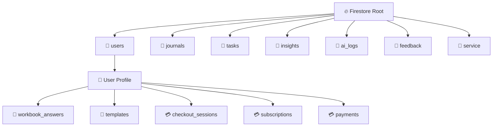

# 🗄️ Schema Architecture & Data Graph

**Storage Engine:** Cloud Firestore (NoSQL)
**Encryption Strategy:** Client-Side AES-GCM (Content fields only)

## 1. High-Level Topology

## 2. Collection Definitions

### `users/{uid}`
* **Purpose:** Profile, Auth, & Settings.
* **Fields:** `encryptionSalt`, `pinVerifier`, `sobrietyDate`, `role`, `fcmTokens`, `timezone`, etc.

### `journals/{entryId}`
* **Purpose:** Daily logs, Vitality logs, and SMART Recovery CBT Tools.
* **Fields:**
    * `uid` (String): Owner ID.
    * `content` (String): **ENCRYPTED BLOB** (format: `iv:ciphertext`).
        * *Note for Virtual Modules:* For SMART CBT Tools, the decrypted plain text is actually a **Stringified JSON Object** containing `{ metadata: {...}, data: {...} }`. The UI parses this JSON after decryption.
    * `isEncrypted` (Boolean): Flag for legacy plain text data handling.
    * `moodScore` (Int): **UNENCRYPTED** (Allows fast dashboard stats).
    * `tags` (Array): **UNENCRYPTED** (e.g., `["Vitality", "Movement"]` or `["SMART Tool", "CBA"]`).

### `tasks/{taskId}`
* **Purpose:** Gamification, Habits, and AI Action Plans. (Unencrypted for streak evaluation).

### `insights/{insightId}`
* **Purpose:** AI-generated analysis of journals/workbooks.

### `feedback/{reportId}`
* **Purpose:** User bug reports and suggestions. (Unencrypted).
