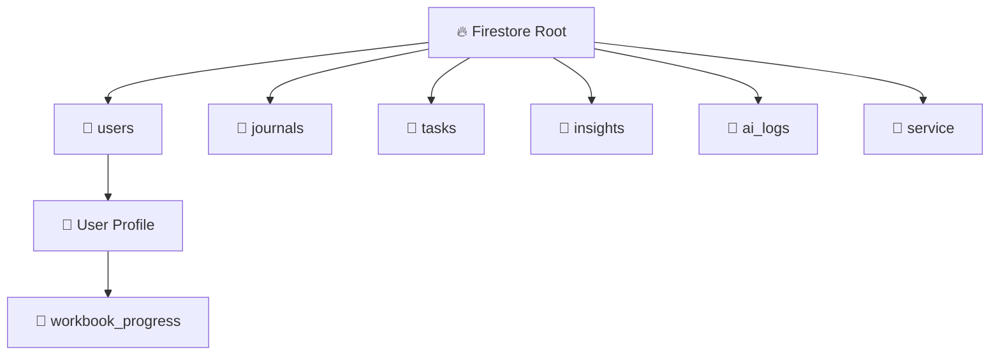

# 🗄️ Schema Architecture & Data Graph

**Storage Engine:** Cloud Firestore (NoSQL)
**Encryption Strategy:** Client-Side AES-GCM (Content fields only)

## 1. High-Level Topology

## 2. Collection Definitions

### `users/{uid}`
* **Purpose:** Profile, Auth, & Encryption Params.
* **Sensitive Fields:**
    * `encryptionSalt` (String): Public salt needed to derive key.
    * `pinVerifier` (String): Hash(PIN + Salt) to verify PIN correctness without storing it.
    * `sobrietyDate` (Timestamp): Metrics base.

### `journals/{entryId}`
* **Purpose:** Daily logs and reflections.
* **Fields:**
    * `content` (String): **ENCRYPTED BLOB** (format: `iv:ciphertext`).
    * `isEncrypted` (Boolean): `true`.
    * `moodScore` (Int): **UNENCRYPTED** (Allows metadata analysis/charts without unlocking vault).
    * `tags` (Array): **UNENCRYPTED** (Allows filtering).
    * `weather` (Map): Snapshot of environment.

### `tasks/{taskId}`
* **Purpose:** Gamification & Habits.
* **Encryption:** Generally unencrypted to allow background stats.
* **Fields:**
    * `title` (String): Quest name.
    * `category` (String): 'Recovery', 'Health', etc.
    * `recurrence` (Map): Logic for repetition.

### `insights/{insightId}`
* **Purpose:** AI-generated analysis of journals/workbooks.
* **Fields:**
    * `summary` (String): The AI's output.
    * `type` (String): 'journal' | 'workbook'.
    * `pillars` (Map): Structured breakdown (Growth, Blind Spots).

### `service/{serviceId}`
* **Purpose:** "Digital Rolodex" for Lisa to manage sponsees/commitments.
* **Fields:**
    * `type` (String): 'sponsee' | 'commitment'.
    * `name` (String): **ENCRYPTED** (Protect identity of sponsees).
    * `notes` (String): **ENCRYPTED** (Private session notes).
    * `contactInfo` (String): **ENCRYPTED**.
    * `status` (String): 'Active' | 'Alumni' (Unencrypted for filtering).
    * `nextMeeting` (Timestamp): **UNENCRYPTED** (Allows push notifications).

## 3. Query Strategy
* **Journal History:** Query by `uid`, order by `createdAt`. Requires client-side decryption loop.
* **Stats:** Query `moodScore` (Journal) or `completed` (Tasks) directly for dashboards (fast, no decrypt needed).