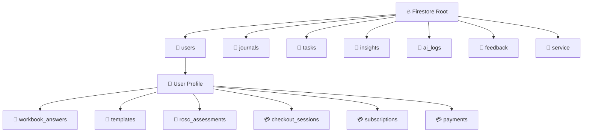

# 🗄️ Schema Architecture & Data Graph

**Storage Engine:** Cloud Firestore (NoSQL)
**Encryption Strategy:** Client-Side AES-GCM (Content fields only)

## 1. High-Level Topology

## 2. Collection Definitions

### `users/{uid}`
* **Purpose:** Profile, Auth, & Settings.
* **Fields:** `hasDeferredVault` (Boolean), `encryptionSalt`, `pinVerifier`, `sobrietyDate`, `role`, `fcmTokens` (Array), `fcmSwVersion` (Number — SW version stamp for one-time token migration on login), `timezone`, `anchorSettings` (Object), etc.
* **`usage_limits` (Map, optional):** Rate-limit timestamps for AI features. Fields: `lastWeeklyInsight`, `lastMonthlyInsight`, `lastDeepDive`, `lastROSCAssessment` (all Timestamps, all optional). Premium users bypass all limits.

### `journals/{entryId}`
* **Purpose:** Daily logs, Vitality logs, and SMART Recovery CBT Tools.
* **Fields:**
    * `uid` (String): Owner ID.
    * `content` (String): **ENCRYPTED BLOB** (format: `iv:ciphertext`).
        * *Note for Virtual Modules:* For SMART CBT Tools, the decrypted plain text is actually a **Stringified JSON Object** containing `{ metadata: {...}, data: {...} }`. The UI parses this JSON after decryption.
    * `isEncrypted` (Boolean): Flag for legacy plain text data handling.
    * `moodScore` (Int): **UNENCRYPTED** (Allows fast dashboard stats).
    * `tags` (Array): **UNENCRYPTED** (e.g., `["Vitality", "Movement"]` or `["SMART Tool", "CBA"]`).
        * *`DRAFT` tag (PROJ-50):* A partial, in-progress guided-tool save carries an extra `'DRAFT'` tag (e.g. `["SMART Tool", "CBA", "DRAFT"]`). Only the final, complete save drops it. `DRAFT`-tagged entries are excluded from XP (`gamification.ts`), from AI pattern analysis (`useDeepPatternAnalysis.ts`), and from the Tools Hub completion-count badge (`useSmartToolCompletions.ts`) — but they do surface a "Resume" entry point on the tool's card.

### `tasks/{taskId}`
* **Purpose:** Gamification, Habits, and AI Action Plans. (Unencrypted for streak evaluation).
* **Fields:**
    * `uid` (String): Owner ID.
    * `title` (String): Task text. **UNENCRYPTED** (required for streak evaluation and AI action routing).
    * `source` (String): `'manual'` | `'ai'` | `'anchor_intent'` — governs tab routing.
    * `status` (String): `'pending'` | `'completed'`.
    * `isRecurring` (Boolean): True for habit-type tasks.
    * `frequency` (String): Legacy field — `'once'` | `'daily'` | `'weekly'` | `'monthly'`.
    * `recurrence` (Map): Full `RecurrenceConfig` object (supersedes `frequency`).
    * `priority` (String): `'High'` | `'Medium'` | `'Low'`.
    * `category` (String, optional): `'Recovery'` | `'Health'` | `'Life'` | `'Work'`.
    * `currentStreak` (Int): Consecutive completion count. Decrements on Smart Reset; resets to 0 (not negative floor) on first miss.
    * `dueDate` (Timestamp): Next scheduled deadline.
    * `lastCompletedAt` (Timestamp | null): Used by Rhythm Score 14-day window and Smart Reset detection.
    * `createdAt` (Timestamp): Document creation time.
    * `sourceContext` (String, optional): **PROJ-46.** AI-generated one-sentence explanation of why this task was recommended (max 120 chars). Only present when `source === 'ai'`. Plaintext — not sensitive content.
    * `sourceRef` (String, optional): **PROJ-46.** Reference for deep-linking back to the insight source. Format: `workbook:{workbookId}` for workbook-derived tasks, or a Firestore insight document ID for insight-derived tasks. Only present when `source === 'ai'`.
    * `originalDayOfMonth` (Int, optional): **PROJ-47.** Stored inside the `recurrence` Map for `type: 'monthly'` tasks. Captures the intended calendar day at creation (e.g. 31) so `calculateNextDueDate()` can restore it after shorter months instead of drifting permanently to Feb 28.
    * `missedCountHistory` (Array\<Int\>, optional): **PROJ-47.** Appended (via `arrayUnion`) during the lazy evaluation pass in `getUserTasks()` each time a recurring task is found overdue. Each element is the number of days missed in that fetch cycle. Never overwritten — append-only. Used for long-term compliance pattern analysis.

### `users/{uid}/rosc_assessments/{assessmentId}`
* **Purpose:** Monthly Recovery Capital snapshot across SAMHSA's four domains. Scores are plaintext metadata readable without vault unlock; AI reasoning is encrypted.
* **Fields:**
    * `uid` (String): Owner ID.
    * `createdAt`, `periodStart`, `periodEnd` (Timestamp): Assessment creation time and the 30-day window analysed.
    * `scores` (Map): Four domain objects — `health`, `home`, `purpose`, `community`. Each contains:
        * `score` (Int 1–10): **UNENCRYPTED** — blended AI + self-report score.
        * `selfReportedScore` (Int 1–5): **UNENCRYPTED** — user's own check-in answer.
        * `evidenceCount` (Int): **UNENCRYPTED** — number of journal entries cited by AI.
    * `totalScore` (Int 4–40): **UNENCRYPTED** — sum of the four domain scores.
    * `trajectory` (String): **UNENCRYPTED** — `'Improving'` | `'Stable'` | `'Declining'` | `'Insufficient Data'`.
    * `journalEntriesAnalysed` (Int): **UNENCRYPTED** — how many journal entries fed the AI.
    * `encryptedAIContext` (String): **ENCRYPTED BLOB** (`iv:ciphertext`) — JSON containing `narrative`, `strengths`, `growth_areas`, and per-domain `evidence` arrays. Empty string for free-tier assessments. Must be included in `executePinRotation` sweep and `executeCryptoShredding`.

### `insights/{insightId}`
* **Purpose:** AI-generated analysis of journals/workbooks.

### `feedback/{reportId}`
* **Purpose:** User bug reports and suggestions. (Unencrypted).
