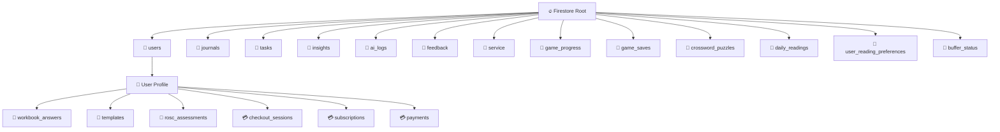

# 🗄️ Schema Architecture & Data Graph

**Storage Engine:** Cloud Firestore (NoSQL)
**Encryption Strategy:** Client-Side AES-GCM (Content fields only)

## 1. High-Level Topology

## 2. Collection Definitions

### `users/{uid}`
* **Purpose:** Profile, Auth, & Settings.
* **Fields:** `hasDeferredVault` (Boolean), `encryptionSalt`, `pinVerifier`, `sobrietyDate`, `role`, `fcmTokens` (Array), `fcmSwVersion` (Number — SW version stamp for one-time token migration on login), `timezone`, `anchorSettings` (Object), `heroColor` (String, optional — one of `amber`/`sky`/`emerald`/`violet`/`rose`; PROJ-56, **UNENCRYPTED** cosmetic preference, defaults to `amber` when absent), `installedWorkbookIds` (Array\<String\>, optional; PROJ-75, **UNENCRYPTED** — which official workbook ids appear in the user's "My Workbooks" library; `undefined` means legacy/new user, treated as all official workbooks installed), etc.
* **`usage_limits` (Map, optional):** Rate-limit timestamps for AI features. Fields: `lastWeeklyInsight`, `lastMonthlyInsight`, `lastDeepDive`, `lastROSCAssessment` (all Timestamps, all optional). Premium users bypass all limits **except** `lastROSCAssessment`, which carries a 24-hour all-tier floor (PROJ-49 §10 addendum) as a defense-in-depth cap independent of the free tier's stricter 30-day check — stamped server-side for both tiers specifically for `rosc_assessment` (every other analysis type stamps free-tier only).
* **`pendingRotation` (Map, optional):** `{ salt, verifier }` — marks an in-flight PIN rotation (`src/lib/rotation.ts`) so an interrupted rotation can resume instead of orphaning already-migrated documents. Present only between the start and successful completion of `executePinRotation`.
* **`pinAttempts` (Map, optional; PROJ-65, server-write-only):** `{ count, lockedUntil?, lastAttemptAt? }` (Timestamps). Rate-limit state for the `verifyVaultPin` Cloud Function — `firestore.rules` denies any client write to this field so the vault-PIN lockout can't be reset or forged client-side.
* **`usesPepperV2` (Boolean, optional; PROJ-65):** True once this account's vault key derivation has moved from direct PBKDF2 to the peppered scheme (PBKDF2 output combined via HMAC with a rate-limited server-held pepper). Set on new vault creation and on every `executePinRotation` completion — see `docs/projects/65_VAULT_KEY_HARDENING.md`.

### `users/{uid}/checkout_sessions/{id}`, `users/{uid}/subscriptions/{id}`, `users/{uid}/payments/{id}`
* **Purpose:** Stripe Firebase Extension subcollections (backend-managed, PROJ-68/premium billing). Users create the checkout-session request; the extension's backend fills in the Stripe-hosted URL and later writes subscription/payment status. **UNENCRYPTED** — Stripe metadata, not recovery content.
* **Access:** `checkout_sessions` — user can `create`/`read`, never `update`/`delete`. `subscriptions` and `payments` — user can `read` only; all writes are `false` (extension-only, via Admin SDK) so a client can never fake a subscription or payment record. See `firestore.rules` lines 111-123.

### `journals/{entryId}`
* **Purpose:** Daily logs, Vitality logs, and SMART Recovery CBT Tools.
* **Fields:**
    * `uid` (String): Owner ID.
    * `content` (String): **ENCRYPTED BLOB** (format: `iv:ciphertext`). `firestore.rules` (PROJ-99) enforces this is a string on every write, and caps it at 50KB on **create only** — not on update, so a pre-existing document already over that ceiling (written before this rule shipped) can still be edited/re-encrypted.
        * *Note for Virtual Modules:* For SMART CBT Tools, the decrypted plain text is actually a **Stringified JSON Object** containing `{ metadata: {...}, data: {...} }`. The UI parses this JSON after decryption.
    * `isEncrypted` (Boolean): Flag for legacy plain text data handling.
    * `moodScore` (Int): **UNENCRYPTED** (Allows fast dashboard stats).
    * `tags` (Array): **UNENCRYPTED** (e.g., `["Vitality", "Movement"]` or `["SMART Tool", "CBA"]`).
        * *`DRAFT` tag (PROJ-50):* A partial, in-progress guided-tool save carries an extra `'DRAFT'` tag (e.g. `["SMART Tool", "CBA", "DRAFT"]`). Only the final, complete save drops it. `DRAFT`-tagged entries are excluded from XP (`gamification.ts`), from AI pattern analysis (`useDeepPatternAnalysis.ts`), and from the Tools Hub completion-count badge (`useSmartToolCompletions.ts`) — but they do surface a "Resume" entry point on the tool's card.

### `tasks/{taskId}`
* **Purpose:** Gamification, Habits, and AI Action Plans. (Unencrypted for streak evaluation).
* **Fields:**
    * `uid` (String): Owner ID.
    * `title` (String): Task text. **UNENCRYPTED** (required for streak evaluation and AI action routing).
    * `source` (String): `'manual'` | `'ai'` | `'anchor_intent'` — governs tab routing.
    * `status` (String): `'pending'` | `'completed'`.
    * `isRecurring` (Boolean): True for habit-type tasks.
    * `frequency` (String): Legacy field — `'once'` | `'daily'` | `'weekly'` | `'monthly'`.
    * `recurrence` (Map): Full `RecurrenceConfig` object (supersedes `frequency`).
    * `priority` (String): `'High'` | `'Medium'` | `'Low'`.
    * `category` (String, optional): `'Recovery'` | `'Health'` | `'Life'` | `'Work'`.
    * `currentStreak` (Int): Consecutive completion count. Decrements on Smart Reset; resets to 0 (not negative floor) on first miss.
    * `dueDate` (Timestamp): Next scheduled deadline.
    * `lastCompletedAt` (Timestamp | null): Used by Rhythm Score 14-day window and Smart Reset detection.
    * `createdAt` (Timestamp): Document creation time.
    * `sourceContext` (String, optional): **PROJ-46.** AI-generated one-sentence explanation of why this task was recommended (max 120 chars). Only present when `source === 'ai'`. Plaintext — not sensitive content.
    * `sourceRef` (String, optional): **PROJ-46.** Reference for deep-linking back to the insight source. Format: `workbook:{workbookId}` for workbook-derived tasks, or a Firestore insight document ID for insight-derived tasks. Only present when `source === 'ai'`.
    * `originalDayOfMonth` (Int, optional): **PROJ-47.** Stored inside the `recurrence` Map for `type: 'monthly'` tasks. Captures the intended calendar day at creation (e.g. 31) so `calculateNextDueDate()` can restore it after shorter months instead of drifting permanently to Feb 28.
    * `missedCountHistory` (Array\<Int\>, optional): **PROJ-47.** Appended (via `arrayUnion`) during the lazy evaluation pass in `getUserTasks()` each time a recurring task is found overdue. Each element is the number of days missed in that fetch cycle. Never overwritten — append-only. Used for long-term compliance pattern analysis.

### `users/{uid}/rosc_assessments/{assessmentId}`
* **Purpose:** Recovery Capital snapshot across SAMHSA's four domains — monthly cadence for free tier, weekly for premium (PROJ-49 §10 addendum). Scores are plaintext metadata readable without vault unlock; AI reasoning is encrypted.
* **Fields:**
    * `uid` (String): Owner ID.
    * `createdAt`, `periodStart`, `periodEnd` (Timestamp): Assessment creation time and the journal window actually analysed — 7 days for premium (30-day fallback if that window yields fewer than 3 journal entries) or 30 days for free tier. `periodStart`/`periodEnd` always reflect the real window used, not the nominal cadence.
    * `scores` (Map): Four domain objects — `health`, `home`, `purpose`, `community`. Each contains:
        * `score` (Int 1–10): **UNENCRYPTED** — blended AI + self-report score.
        * `selfReportedScore` (Int 1–5): **UNENCRYPTED** — user's own check-in answer.
        * `evidenceCount` (Int): **UNENCRYPTED** — number of journal entries cited by AI.
    * `totalScore` (Int 4–40): **UNENCRYPTED** — sum of the four domain scores.
    * `trajectory` (String): **UNENCRYPTED** — `'Improving'` | `'Stable'` | `'Declining'` | `'Insufficient Data'`.
    * `journalEntriesAnalysed` (Int): **UNENCRYPTED** — how many journal entries fed the AI.
    * `encryptedAIContext` (String): **ENCRYPTED BLOB** (`iv:ciphertext`) — JSON containing `narrative`, `strengths`, `growth_areas`, and per-domain `evidence` arrays. Empty string for free-tier assessments. Must be included in `executePinRotation` sweep and `executeCryptoShredding`.

### `users/{uid}/templates/{templateId}`
* **Purpose:** User-authored custom journal templates (Premium feature). **UNENCRYPTED** — template scaffolding/prompt text, not personal disclosure content; not currently in CLAUDE.md's ZK boundary table (pre-existing gap, flagged during PROJ-59 — needs a product decision on whether `content` should be encrypted).
* **Fields:**
    * `uid` (String, optional): Owner ID — redundant with the subcollection path, written for export/query convenience.
    * `name` (String): Template display name.
    * `content` (String, optional): Free-text Markdown body for current-style templates.
    * `prompts` (Array\<String\>, optional): Legacy prompt-form templates (superseded by free-text `content`, but still read for backward compatibility).
    * `defaultTags` (Array\<String\>): Tags auto-applied to journal entries created from this template.
    * `createdAt`, `updatedAt` (Timestamp, optional): Set on create / every save respectively.

### `insights/{insightId}`
* **Purpose:** AI-generated analysis of journals/workbooks. **UNENCRYPTED** (see CLAUDE.md ZK boundary table).
* **Fields:**
    * `uid` (String): Owner ID.
    * `type` (String): `'journal'` | `'workbook'`.
    * `summary` (String): AI narrative.
    * `pillars` (Map): `understanding`, `blind_spots`, plus a third field that differs by `type` — `growth` for `type: 'journal'`, `emotional_resonance` for `type: 'workbook'`. See `docs/specs/10_INSIGHTS.md` for the full breakdown; `src/lib/insights.ts`'s `InsightPayload` is the source-of-truth type.
    * `suggested_actions` (Array\<String\>): Up to 3 recommended habits, surfaced as "Add to Quest" buttons.
    * `scope_context` (String): Human-readable label for the analysis window (e.g. `"Weekly Comparative Review"`, `"Deep Pattern Recognition"`).
    * `createdAt` (Timestamp).
    * Journal-type only (all optional): `key_themes`, `strengths`, `risks`, `trajectory`, `core_triggers`, `hidden_correlations`, `emotional_velocity`, `relapse_risk_level`.

### `service/{serviceId}`
* **Purpose:** PROJ-05 (The Service Network / Lisa Module) — sponsor/sponsee service notes. Placeholder collection with real `firestore.rules` coverage already in place (owner-scoped CRUD) ahead of the feature itself, which is `⏸️ Paused`. **ENCRYPTED** per the ZK boundary table in `CLAUDE.md` (sponsee notes).

### `game_progress/{id}`
* **Purpose:** PROJ-72 (Recovery Games). Per-play completion records for mini-games (e.g. Craving Buster). Partial encryption — same precedent as `rosc_assessments`, so streak/XP math never needs a decrypt.
* **Fields:**
    * `uid` (String): Owner ID.
    * `gameId` (String): **UNENCRYPTED** — e.g. `'craving-buster'`.
    * `personaTarget` (String): **UNENCRYPTED** — `'David'` | `'Ned'` | `'Lisa'` | `'Walt'` | `'All'` (Phase 6 — games not tied to one persona, e.g. Knowledge Quests).
    * `score` (Int): **UNENCRYPTED** — feeds `gamification.ts`'s `calculateUserLevel` (`action` bucket) without a decrypt.
    * `encryptedStats` (String): **ENCRYPTED BLOB** (`iv:ciphertext`) — `JSON.stringify` of the game's per-play stats (e.g. `{ tapsHit, tapsTotal, rhythmAccuracy }` for Craving Buster).
    * `encryptedReflection` (String, optional): **ENCRYPTED BLOB** (`iv:ciphertext`) — only present for games with a reflective component (`recordReflection` on the `IRecoveryGame` interface).
    * `createdAt` (Timestamp).
    * `isEncrypted` (Boolean): Always `true` — included in `executePinRotation`, `executeCryptoShredding`, and `executeTotalAccountAnnihilation` (Phase 7).

### `game_saves/{id}`
* **Purpose:** PROJ-72 Phase 4. A resumable, continuously-updated save-slot for multi-session games (e.g. Fast Lane) — distinct from `game_progress`'s append-only completed-play log. One doc per `(uid, gameId)`, doc ID `${uid}_${gameId}`, upserted via `setDoc`. Fully encrypted — this is live in-progress state, not a completed-event snapshot, so there are no plaintext fields needed for streak/XP math.
* **Fields:**
    * `uid` (String): Owner ID.
    * `gameId` (String): **UNENCRYPTED** — e.g. `'fast-lane'`.
    * `encryptedState` (String): **ENCRYPTED BLOB** (`iv:ciphertext`) — `JSON.stringify` of the game's full save state. `firestore.rules` (PROJ-99) enforces this is a string on every write, and caps it at 200KB on create only (same update-time exemption as `journals.content`, same reasoning).
    * `updatedAt` (Timestamp).
    * `isEncrypted` (Boolean): Always `true` — included in `executePinRotation`, `executeCryptoShredding`, and `executeTotalAccountAnnihilation` (Phase 7).

### `crossword_puzzles/{date}`
* **Purpose:** PROJ-79 (Daily Crossword, Recovery Games #8). One shared, AI-authored puzzle per calendar date (`YYYY-MM-DD` doc ID), identical for every user — generated nightly by `generateDailyCrossword` (a scheduled Cloud Function). Server-write-only (`isAdmin()`), read-any-authenticated — same access shape as `daily_readings`. **UNENCRYPTED** — editorial puzzle content only, no user data of any kind (unlike every other Recovery Games collection).
* **Fields:**
    * `date` (String): `YYYY-MM-DD`, also the doc ID.
    * `theme` (String), `themeIntro` (String): the day's theme and its one-sentence framing.
    * `generatorVersion` / `promptVersion` (String): reproducibility/rollback markers — a bad puzzle is fixed by bumping one of these and regenerating, not by a code revert.
    * `words` (Array of `{ answer, clue, clueStyle, hint, themed, difficulty, number, row, col, direction }`): `difficulty` is generation-internal only, never rendered client-side.
    * `insightCard` (Object): `{ text, frameworkTags }` — a short reflection shown on solve.
    * `grid` (Object): `{ rows, cols }`, attached by the deterministic (non-AI) `crossword-layout-generator` library post-generation.
    * `generatedAt` (Timestamp).
* Per-user solve completion reuses `game_progress` (`gameId: 'daily-crossword'`, `personaTarget: 'All'`) exactly like every other game — no new persistence pattern — but is explicitly excluded from XP (`AchievementsTab.tsx` filters it out of `gameProgressCount`), matching the source spec's reward-free framing.

### `daily_readings/{modality}_{date}`
* **Purpose:** PROJ-42 (Daily Readings Engine). Admin/Cloud-Function-generated reading content, one doc per `(modality, date)` pair, doc ID `${modality}_${date}`. Server-write-only (`generateReadingBatch`); all-read client rule. **UNENCRYPTED** — curated editorial content, not user disclosure.
* **Fields:**
    * `id` (String): Redundant with doc ID, written for query convenience.
    * `modality` (String): `'12-step'` | `'recovery-dharma'` | `'women-for-recovery'` | `'smart-recovery'` | `'secular-stoic'` | `'mindfulness-buddhist'`.
    * `date` (String): `"YYYY-MM-DD"`.
    * `theme`, `title`, `body`, `reflection`, `affirmation` (String): Reading content.
    * `attribution` (String, optional): Required for `recovery-dharma` (CC BY-SA 4.0 sourcing).
    * `goDeeper` (Map, optional): `{ label, url }`.
    * `generatedAt` (Timestamp): Server-set on generation.
    * `bufferBatch` (Number): Which generation batch produced this doc.

### `user_reading_preferences/{uid}`
* **Purpose:** PROJ-42. Per-user modality selection and read-progress tracking for Daily Readings. **UNENCRYPTED** — preference/progress metadata, not recovery content.
* **Fields:**
    * `uid` (String): Owner ID.
    * `selectedModalities` (Array\<String\>): Subset of the `ReadingModality` values above.
    * `lastReadDate` (String): `"YYYY-MM-DD"`.
    * `readingHistory` (Array\<String\>): Doc IDs of previously-read entries.

### `buffer_status/{modality}`
* **Purpose:** PROJ-42. Cloud-Function-internal tracker of how far ahead each modality's reading buffer is generated (`checkBufferHealth`/`generateReadingBatch`). Has an explicit `firestore.rules` deny-all entry (added 2026-08-04 governance remediation) — this collection is never read or written from the client, only from Admin-SDK Cloud Functions, so the rule denies all client access rather than relying on default-deny alone.
* **Fields:**
    * `lastGeneratedDate` (String): `"YYYY-MM-DD"` — last date this modality has a generated reading for.
    * `totalBuffered` (Number): Count of readings generated in the run that last updated this doc.
    * `lastBatchGeneratedAt` (Timestamp): Server-set on each generation pass.

### `feedback/{reportId}`
* **Purpose:** User bug reports and suggestions. (Unencrypted).
