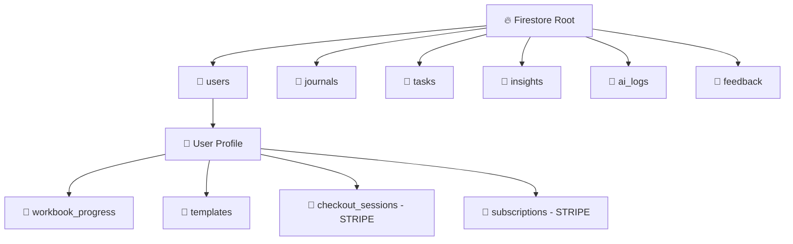

# 🗄️ Schema Architecture & Data Graph

**Storage Engine:** Cloud Firestore (NoSQL)
**Encryption Strategy:** Client-Side AES-GCM (Content fields only)

## 1. High-Level Topology

## 2. Collection Definitions

### `users/{uid}`
* **Purpose:** Profile, Auth, & Settings.
* **Fields:**
    * `encryptionSalt` (String): Public salt needed to derive key.
    * `pinVerifier` (String): Hash(PIN + Salt) to verify PIN correctness.
    * `sobrietyDate` (Timestamp): Metrics base.
    * `role` (String): 'user' | 'admin'.
    * `tier` (String): 'free' | 'premium'. (Monetization status).
    * `usage_limits` (Map): AI throttling caps.
* **Subcollections (Stripe Managed):**
    * `checkout_sessions`: Client writes here to trigger Stripe Checkout.
    * `subscriptions`: Webhook writes here to verify active payment status.

### `journals/{entryId}`
* **Purpose:** Daily logs, Vitality logs, and reflections.
* **Fields:** `uid`, `content` (**ENCRYPTED BLOB**), `moodScore` (Unencrypted), `tags` (Array), `weather`.

### `tasks/{taskId}`
* **Purpose:** Gamification, Habits, and AI Action Plans.
* **Encryption:** Unencrypted to allow background stats and streak evaluations.

### `insights/{insightId}`
* **Purpose:** AI-generated analysis of journals/workbooks.
* **Fields:** `type`, `summary`, `relapse_risk_level`, `trajectory`, `suggested_actions`.

### `feedback/{reportId}`
* **Purpose:** User bug reports and suggestions.
* **Encryption:** **NONE** (To allow debugging without user PIN).
