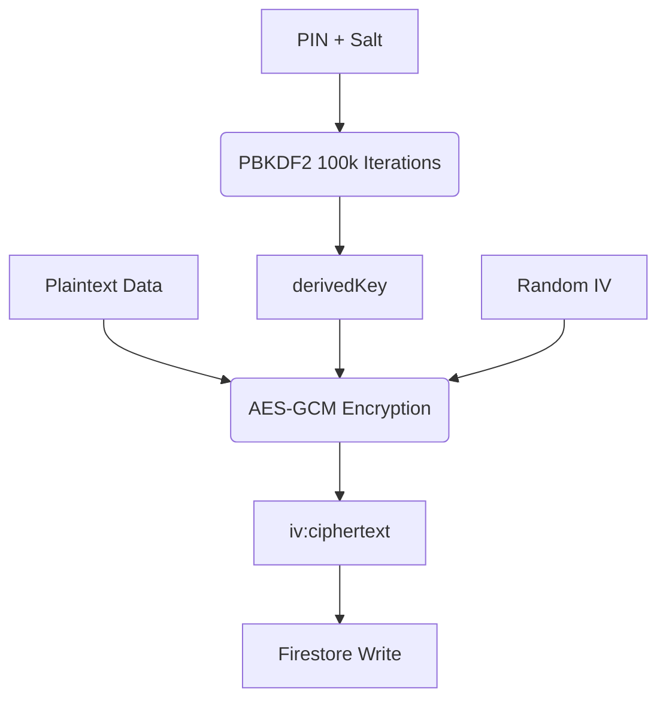
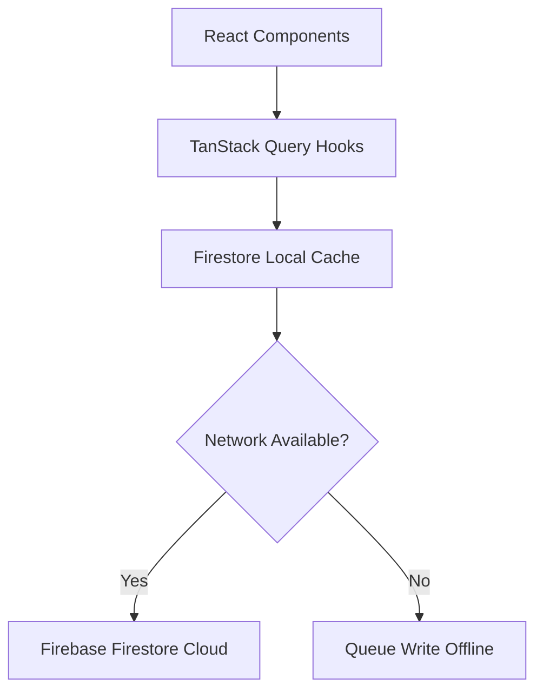

# 🛡️ My Recovery Toolkit (MRT) — Living System Overview

> [!NOTE]
> This is a living document outlining MRT's architecture, security boundaries, database schemas, contexts, hooks, pages, components, and design system. 
> Keep this document updated in **Phase 4 (Crystallization)** of the Recursive Build Protocol whenever files are modified, refactored, or added.

---

## 1. Executive Summary & Mission
My Recovery Toolkit (MRT) is a high-performance, mobile-first **Zero-Knowledge** digital companion designed for individuals navigating Twelve-Step, CBT, DBT, Mindfulness, and Buddhist-inspired recovery journeys. 

### Core Product Philosophy
*   **"We cannot leak what we cannot read":** Sensitive personal disclosures are encrypted client-side and never exist in plaintext outside the user's device.
*   **Recovery as a High-Performance Lifestyle:** The app uses high-saturation dynamic designs, micro-animations, and positive gamification (streaks, Rhythm Score) to shift the mindset from passive avoidance to active, energized mastery.
*   **Offline-First Resilience:** In acute crises, connectivity is often flaky. The app must function fully offline, syncing data safely when connections return.

### Freemium Tiers
*   **Free Tier:** Core tools (Sobriety Counter, My Dashboard, My Tasks, My Journal (encrypted journaling), My Vitality (somatic logs/breathwork), Urge Surfer/SOS crisis intervention).
*   **Premium Tier:** Advanced insights (Unlimited AI Compass deep pattern scans, Service Module sponsee rolodex, customized templates, export to PDF/JSON).

---

## 2. Directory Structure & Module Map
The codebase is structured around React 19, TypeScript, Vite, Tailwind CSS v4, and Firebase v12.

```
/workspaces/MRT2
├── functions/                     # Firebase Cloud Functions (Typescript)
│   └── src/                       # Stripe hook, Telemetry, AI prompt templates
├── public/                        # Static assets & PWA Service Worker (Vite PWA/Workbox)
├── docs/                          # Architecture specs & Developer governance
│   └── specs/                     # Feature-specific design specifications
├── src/
│   ├── contexts/                  # Global providers (Auth, Encryption, Layout)
│   ├── hooks/                     # Custom TanStack Query & business logic hooks
│   ├── lib/                       # Stateless utilities, crypto boundary, type interfaces
│   ├── components/                # Reusable UI components grouped by feature
│   │   ├── admin/                 # Telemetry & moderation widgets
│   │   ├── dashboard/             # Horizon components (Counters, Quick Actions)
│   │   ├── journal/               # Audio, Template, and Editor components
│   │   ├── profile/               # Data management, security, and settings
│   │   ├── readings/              # Daily literature and modalities
│   │   ├── smart_tools/           # CBT/REBT step-by-step interactive engines
│   │   ├── tasks/                 # Swipeable list items & Rhythm ring
│   │   ├── tools/                 # Shared form elements & selectors
│   │   ├── ui/                    # Base design components (GlassCard, PillBar)
│   │   └── vitality/              # Somatic tabs (Breath, Fuel, Move)
│   ├── pages/                     # Route-level views (Dashboard, Journal, etc.)
│   ├── data/                      # Static metadata (Workbooks content, fellowship rules)
│   └── test/                      # Vitest mock setups and unit test suites
```

---

## 3. Zero-Knowledge Cryptographic Model
The cryptographic boundary is strictly defined in `src/lib/crypto.ts` and managed globally by `EncryptionContext.tsx`.



### Key Derivation & Session Cache
1.  **PIN & Salt:** The user configures a 4-digit PIN. The app generates a cryptographically secure random 16-byte `Salt` and store it in plaintext in Firestore (`users/{uid}/encryptionSalt`).
2.  **PBKDF2 Derivation:** A symmetric `CryptoKey` is derived client-side via PBKDF2 using the PIN, Salt, and 100,000 iterations of SHA-256.
3.  **Verifier:** To validate the PIN on subsequent entries without storing it, the app creates a `verifier` hash = `SHA-256(PIN + Salt)` stored in Firestore.
4.  **Session Security:** The PIN is temporarily cached in the browser's `sessionStorage` to avoid continuous prompts during active navigation. It is deleted immediately on tab close or manual lock.

### Data Read & Write Pipeline
*   **Encryption (Writes):** For sensitive fields, the app generates a random 12-byte Initialization Vector (IV). Content is encrypted using AES-GCM. The resulting string is saved as `IV:Ciphertext` in Firestore.
*   **Decryption (Reads):** When loading, the app fetches `IV:Ciphertext`, splits it, and decrypts using the derived key. Plaintext is only held in local React state and never sent to remote logs or global caches.
*   **Vault Locking:** When locked, the `globalKey` in memory is set to `null` and `sessionStorage` is cleared.

### Key Lifecycle Operations
*   **PIN Rotation (`src/lib/rotation.ts`):** 
    1.  Downloads all encrypted user data.
    2.  Decrypts data using the old key.
    3.  Derives a new key using the new PIN/Salt.
    4.  Re-encrypts all data.
    5.  Performs updates in chunked batches of 50 using cursors to prevent UI lockups, yielding execution back to the main thread.
    6.  Reverts to the old key in a `try/catch` rollback block if network drops.
*   **Crypto-Shredding (Vault Reset):** If the user loses their PIN, decryption is mathematically impossible. A vault reset deletes all encrypted files (`journals`, `workbook_answers`) and removes the `encryptionSalt` and `pinVerifier`, starting fresh.

---

## 4. AI Isolation & Integration Boundary
MRT integrates Google Gemini (2.5 Flash and 2.5 Flash-Lite) via a Cloud Function proxy, respecting the Zero-Knowledge boundary.

### Stateless Processing
*   No training is performed on MRT user data. Prompts are treated statelessly.
*   Plaintext is decrypted *only* in-browser, sent directly to Gemini via secure HTTPS, and the response is handled immediately.

### Model Selection (`getModelForType()` in `functions/src/index.ts`)
The `generateAIInsights` Cloud Function resolves a model server-side based on `analysisType`:
1.  **gemini-2.5-flash (Deep Reasoning default):** Used for high-context tasks: `deep_pattern_analysis` (90-day journal reviews), `comparative_analysis`, `system_health_analysis`, `workbook_analysis`, and `rosc_assessment`.
2.  **gemini-2.5-flash-lite (Cost-Effective Speed):** Low-complexity, rapid feedback: `journal_analysis`, `workbook_coach`, `cbt_coaching_prompt`, `cba_reflection`, and `audio_analysis`.

There is no client-side model cascade or fallback path — model selection is a single server-side switch, and the client (`src/lib/gemini.ts`) only calls the `generateAIInsights` proxy.

### Strict JSON Structure enforcement
*   Prompts append: `Return ONLY raw JSON. No Markdown.`
*   Responses are cleaned via a `cleanJSON()` helper, stripping backticks and markdown fences.

---

## 5. Firestore Collection Schema Matrix
A comprehensive guide to the database collections in Cloud Firestore.

| Collection Name | Parent / Path | Encrypted Fields | Plaintext Fields | Purpose |
| :--- | :--- | :--- | :--- | :--- |
| **`users`** | `users/{uid}` | *None* | `hasDeferredVault`, `encryptionSalt`, `pinVerifier`, `sobrietyDate`, `role`, `fcmTokens`, `fcmSwVersion`, `timezone`, `anchorSettings`, `heroColor`, `usage_limits` | Main user configuration, subscription limits, and cosmetic styles |
| **`journals`** | `journals/{entryId}` | `content` (contains the encrypted stringified JSON for journals, mood records, and CBT tool configurations) | `uid`, `isEncrypted`, `moodScore`, `tags` (can include `'Vitality'`, `'Movement'`, `'DRAFT'`) | Encrypted daily journal logs, somatic records, and CBT interactive tool steps |
| **`tasks`** | `tasks/{taskId}` | *None* | `uid`, `title`, `source` (`'manual'`/`'ai'`/`'anchor_intent'`), `status` (`'pending'`/`'completed'`), `isRecurring`, `recurrence` (Map), `priority`, `category`, `currentStreak`, `dueDate`, `lastCompletedAt`, `createdAt`, `sourceContext`, `sourceRef` | Habit tracker and daily checklists (unencrypted for automated streak/reset evaluations) |
| **`rosc_assessments`**| `users/{uid}/rosc_assessments/{id}`| `encryptedAIContext` (JSON string containing domain narrative details) | `uid`, `createdAt`, `periodStart`, `periodEnd`, `scores` (Health, Home, Purpose, Community scores out of 10), `totalScore`, `trajectory`, `journalEntriesAnalysed` | Monthly Recovery Capital metrics and assessments |
| **`templates`** | `users/{uid}/templates/{id}` | *None* | `uid`, `name`, `content`, `prompts`, `defaultTags`, `createdAt`, `updatedAt` | Scaffolding templates for journal entries (Premium feature) |
| **`insights`** | `insights/{id}` | *None* | `uid`, `type`, `summary`, `pillars`, `suggested_actions`, `scope_context`, `createdAt`, and thematic metadata | AI-generated reflection patterns and relapse risk alerts |
| **`workbook_answers`**| `users/{uid}/workbook_answers/{id}`| `answers` (Map of step-specific literature answers) | `uid`, `workbookId`, `stepNumber`, `updatedAt` | Multi-step 12-Step workbook answers |
| **`feedback`** | `feedback/{id}` | *None* | `uid`, `category`, `comment`, `createdAt` | User-reported bugs or ideas |

---

## 6. State Management, Caching, & PWA Engine



### TanStack Query Rules (`src/hooks/`)
*   Every Firestore operation flows through TanStack Query (`useQuery` / `useMutation`).
*   **Cache Invalidation:** Mutations must strictly invalidate the correct user-scoped keys (e.g. `['journals', uid]`, not a generic `['journals']`) to prevent data leakage and caching bugs.
*   **Optimistic Updates:** Mutations temporarily update the cache before remote resolution. If the write fails, the UI rolls back to the previous snapshot cached in TanStack Query.

### Offline-First & Service Worker
*   **Vite PWA + Workbox:** Static UI assets, styles, and scripts are cached locally via a Service Worker.
*   **LayoutContext Sync Banner:** Monitors connection status (`navigator.onLine` & Firebase link status) to display an indicator ("Offline Mode" or "Saved").
*   **Firestore Offline Persistence:** Firebase's offline caching stores local writes. They automatically sync to the server when the user returns online.

---

## 7. Component & Module Breakdown
Below is the technical specification of the main features in `src/components/` and `src/pages/`.

### A. My Dashboard
*   **`pages/Dashboard.tsx`:** Coordinates the daily view. Uses `useDashboardData.ts` to compute current sobriety counters, habit compliance streaks, and biometric vital scores.
*   **`components/SobrietyHero.tsx`:** Large header showing years, months, and days clean, with options to adjust the sobriety date or change the cosmetic theme.
*   **`components/dashboard/DynamicAnchorWidget.tsx`:** A context-aware panel rendering quick somatic breath exercises and crisis support lines depending on the time of day.
*   **`components/tasks/RhythmScoreRing.tsx`:** Visual ring representing the 14-day compliance metric.

### B. My Journal
*   **`pages/Journal.tsx`:** Split-view editor for reflection history.
*   **`components/journal/JournalEditor.tsx`:** Secure text editor. Decrypts and saves text via `useJournalOperations.ts`. Incorporates `useAutoSave.ts` to prevent data loss.
*   **`components/journal/JournalAnalysisWizard.tsx`:** Opt-in wizard triggering client-side Gemini analysis (`generateJournalAnalysis`). Extracted sentiments and tags are saved back as unencrypted tags.
*   **`components/journal/AudioRecorder.tsx`:** Multi-modal recording module, uploading encrypted audio snippets or using local voice recognition to transcribe content into the journal.

### C. My Workbooks
*   **`pages/Workbooks.tsx` & `WorkbookDetail.tsx`:** Access structured 12-Step literature and Buddhist Recovery Dharma questions.
*   **`pages/WorkbookSession.tsx`:** Interactive reading and writing environment. Decrypts step-specific questions using the `useWorkbookAnswers.ts` hook. Saves answers client-side to `workbook_answers` collections.

### D. My Vitality
*   **`pages/Vitality.tsx`:** Core somatic wellness dashboard, split into Breath, Fuel, and Move tabs.
*   **`components/vitality/BreathTab.tsx`:** Guided breath pacing using `useBreathEngine.ts` and the browser Haptics API (`lib/haptics.ts`) for tactile rhythm feedback.
*   **`components/vitality/MoveTab.tsx` & `FuelTab.tsx`:** Rapid log entry grids for recording somatic activities, hydration, and nutritional state.

### E. The Anchor (Urge Surfer)
*   **`pages/UrgeSurfer.tsx`:** Immediate grounding page designed for high-stress states.
*   **`components/SOSModal.tsx`:** Full-screen overlay triggered by one tap. Bypasses lock/vault screens to give immediate access to local hotlines, user-configured sponsor numbers, and dynamic mindfulness pacers.

### G. My Insights
*   **`pages/InsightsLog.tsx`:** Secure summary interface showing emotional trajectories and trigger alerts.
*   **`components/insights/ROSCCheckIn.tsx`:** Prompts the user for a monthly Recovery Capital self-report (SAMHSA Health, Home, Purpose, and Community domains).
*   **`components/insights/ROSCPillCapsules.tsx`:** Custom visual bar charts illustrating longitudinal trends of recovery capital metrics.

### H. Service Network (Rolodex)
*   **`components/admin/FriendsDirectory.tsx`:** Premium sponsee tracking rolodex. Sponsees are identified anonymously. Notes and sponsee names are encrypted with the sponsor's derived key, securing client data.

---

## 8. Theme, Aesthetics, & Atmospheric Tinting
The app applies "Atmospheric Tinting" to guide the user's emotional state, using high-saturation Tailwind gradients:

| Module | Purpose / Vibe | Gradient Color Pair | Theme Hook |
| :--- | :--- | :--- | :--- |
| **Dashboard** | Clarity & Hope | Sky → Blue → Indigo | `bg-slate-200` |
| **My Journal** | Quiet Reflection & Focus | Indigo → Purple → Violet | `bg-indigo-200` |
| **Tasks & Habits** | Action & Energy | Cyan → Teal → Emerald | `bg-cyan-200` |
| **Workbooks** | Systematic Growth & Literature | Emerald → Green → Lime | `bg-emerald-200` |
| **Compass Insights**| Mindful & Intuitive AI | Fuchsia → Pink → Rose | `bg-fuchsia-200` |
| **Somatic Vitality**| Bodily Grounding & Pacing | Rose → Orange → Amber | `bg-orange-200` |
| **Service Rolodex** (Future)| Empathy & Warmth | Rose → Amber | `bg-orange-200` |
| **Profile** | Identity & Security Settings | Slate → Gray → Zinc | `bg-zinc-300` |

### Custom Sobriety Themes
Using `useHeroColor.ts`, users select one of 5 presets (`amber`, `sky`, `emerald`, `violet`, `rose`). This choice is stored as an unencrypted profile field (`heroColor`) and styles the main dashboard.

---

## 9. Developer & AI Governance rules
The development cycle is bound by the **Recursive Build Protocol** outlined in `docs/governance/DEVELOPER_GUIDE.md`:

```
Phase 1: Ingestion -> Phase 2: Definition -> Phase 3: Execution -> Phase 4: Crystallization
```

1.  **Ingestion:** Always review `00-MASTER-INDEX.md` and appropriate chunk files in `llm-export/` before acting.
2.  **Definition:** Draft specs, verify Firestore composite indices, and outline data schema alterations. Do not write code without an approved strategy.
3.  **Execution:** Ensure complete TypeScript safety. No `any` keywords, mandate `import type`, and use try/catch blocks with fallbacks.
4.  **Crystallization (Documentation Policy):**
    *   **Spec Synchronization:** Update feature specs in `docs/specs/` to match codebase changes.
    *   **Master Index Sync:** If files are added or deleted, run `npm run export:llm` to update export chunks.
    *   **Overview Update:** Update this file (`docs/SYSTEM_OVERVIEW.md`) to reflect any changes to data structures, components, hooks, or folders.
