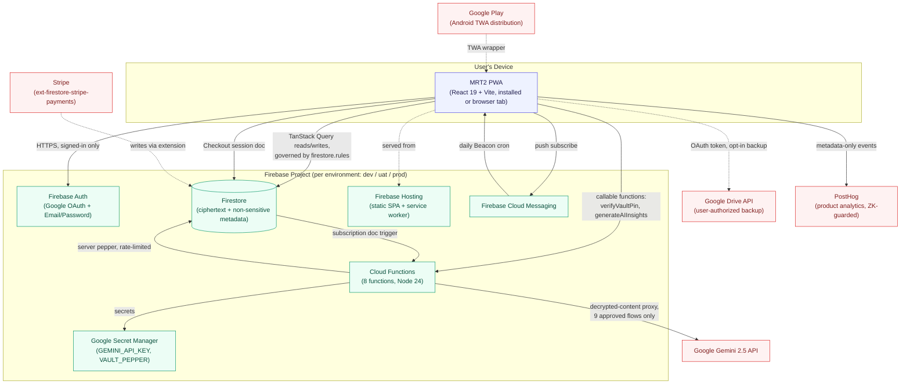
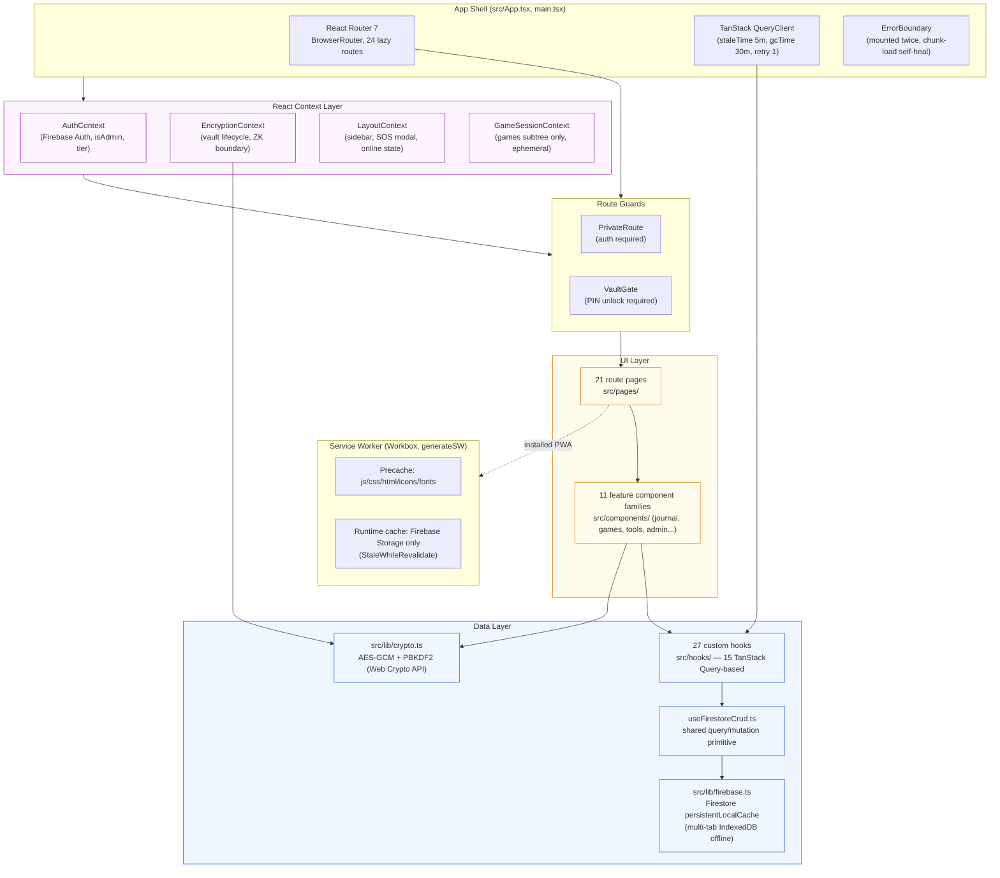
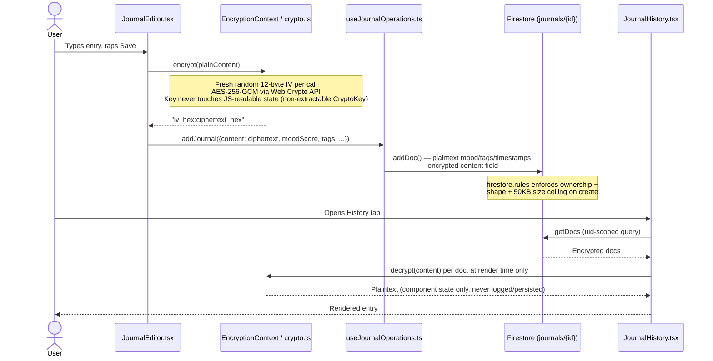

# MRT2 — Architecture Review

*Part of the MRT2 Comprehensive Software Architecture & Product Audit. Evidence gathered by direct repository inspection (folder structure, source reads, config reads, `npm audit`, `tsc --noEmit`, `npm run build`, `npm run test:once`) on 2026-08-29. No assumptions are presented as fact — where something could not be verified, it is stated explicitly.*

---

## 1. System Overview

MRT ("My Recovery Toolkit") is a zero-knowledge, offline-first Progressive Web App for 12-Step and Buddhist-inspired addiction recovery. It is a client-heavy single-page application: nearly all product logic, encryption, and rendering happens in the browser/PWA shell, with Firebase providing Auth, Firestore, Hosting, Cloud Functions, and Cloud Messaging, and Google Gemini providing AI analysis behind a server-side proxy.

**Core architectural thesis:** the server (Firebase project) is deliberately kept "dumb" with respect to user content — Firestore stores ciphertext it cannot read, Cloud Functions never persist decrypted content, and the only plaintext the backend ever sees is either non-sensitive metadata (explicitly catalogued in `CLAUDE.md`) or a SHA-256 hash of a 4-digit PIN used solely for a rate-limited pepper exchange. This is a genuine, code-verified zero-knowledge design (see `08_SECURITY_ASSESSMENT.md`), not a marketing claim.

## 2. System Context Diagram

## 3. Container Diagram (client-side)

## 4. Zero-Knowledge Data Flow (representative: Journal entry)

## 5. Cloud Functions Inventory (`functions/src/index.ts`, verified by direct read)

| Function | Trigger | Purpose | Notable hardening |
|---|---|---|---|
| `dailyBeacon` | Scheduled, `0 12 * * *` | "The Beacon" — daily milestone/habit push notifications, batched over all users | `maxInstances: 1` (idempotency guard against duplicate sends) |
| `checkBufferHealth` | Scheduled, `1 0 * * *` | Regenerates the daily-readings content buffer via Gemini when running low | — |
| `generateDailyCrossword` | Scheduled, `0 6 * * *` | Generates tomorrow's crossword via Gemini (zero user data sent) | Self-heals today's puzzle if missing |
| `generateReadingsAdmin` | Callable | Admin-only manual backfill of daily readings | Server-side custom-claim check |
| `syncStripeSubscription` | Firestore trigger (`onDocumentWritten`) | Flips user tier based on Stripe subscription status | Client cannot write to the triggering subcollection (`write: if false`) |
| `generateAIInsights` | Callable, `maxInstances: 20` | The single Gemini proxy for all 9 approved client AI flows | Per-user cadence limits, payload-shape validation, prompt-injection delimiting |
| `verifyVaultPin` | Callable | PROJ-65 vault-key-hardening: exchanges a PIN hash for a server pepper | Server-side escalating lockout (60s → 15min → 24h), transactional, unit-tested |

Two functions (`dailyBeacon`, and by extension the whole push pipeline) and `verifyVaultPin` are the most operationally load-bearing; both were independently verified (not just documented) to behave correctly under the constraints claimed for them.

## 6. Architectural Strengths (evidence-based)

1. **The zero-knowledge boundary is real, not aspirational.** Fresh IV per encryption call, non-extractable `CryptoKey`, no `encryptData`/decrypt calls found bypassing the boundary in the 8 hooks/lib modules spot-checked, and a dedicated regression-guard test (`useVitalityEntries.test.ts`'s "ZK boundary regression guard" describe block) exists specifically to catch a future violation.
2. **Firestore offline persistence is correctly modern**, using `persistentLocalCache` with `persistentMultipleTabManager` (the current, non-deprecated Firebase v12 API) — multi-tab offline support out of the box, no custom IndexedDB layer needed.
3. **PostHog telemetry is architecturally ZK-guarded**, not just policy-guarded — `src/lib/telemetry.ts`'s `safeCapture()` wrapper and its documented event list show a consistent pattern of stripping to event name + non-content metadata (mutation error events explicitly never include the mutation input, precisely because it "may contain decrypted content").
4. **The manual Vite chunking strategy is unusually deliberate** for a project this size — each chunk bucket (firebase, recharts, gemini, react-vendor, tanstack-query, icons, pdf-export, posthog, vendor) carries an inline PERF-rationale comment tied to a named audit (PROJ "PERF-01").
5. **Cross-cutting state is minimal and justified.** No Redux/Zustand/Jotai in the stack; the one candidate for a global store (`GameSessionContext`) was deliberately scoped to the games subtree only, with the rejection of Zustand documented in the code itself.
6. **Admin authorization is genuinely server-enforced**, not merely UI-gated: both `firestore.rules`'s `isAdmin()` and at least one Cloud Function (`generateReadingsAdmin`) independently check the real, client-unforgeable Firebase custom claim — a client-writable `role` field fallback exists for UI purposes only and cannot be used to bypass either server-side check.
7. **Vault PIN rate-limiting is a genuinely server-side control**, verified via `firestore.rules` explicitly excluding `pinAttempts` from client-writable fields — this closes a class of bug ("client-side-only rate limiting") that is extremely common in apps with a PIN/passcode gate.

## 7. Architectural Weaknesses / Risks (evidence-based)

1. **No Firebase App Check on any Cloud Function.** Confirmed absent by a repo-wide grep (zero matches for `appCheck`/`AppCheck`) and independently corroborated by the project's own internal `docs/reports/2026-08_full_production_readiness_audit.md`. Every callable (`verifyVaultPin`, `generateAIInsights`, `generateReadingsAdmin`) is protected only by Firebase Auth + per-user rate limits — there is no attestation that traffic originates from the genuine app. See `08_SECURITY_ASSESSMENT.md` for exploitability analysis.
2. **Legacy (pre-PROJ-65) accounts derive their vault key from PBKDF2(100k, SHA-256) alone**, with no server-side pepper, until the user rotates their PIN. This is a documented, accepted, migration-pending gap in the codebase's own governance docs — but it is a live weakness for any account that hasn't rotated since the feature shipped.
3. **Encrypt-before-write is enforced by code convention/comment, not structurally.** `useFirestoreCrud.ts`'s shared mutation primitive relies on callers remembering to call `encrypt()` before invoking it; nothing in the hook itself or in `firestore.rules` can detect a document that should be ciphertext but isn't. No current violation was found, but this is a latent regression risk for any future feature built on this primitive.
4. **Shape/size validation in `firestore.rules` covers only 2 of 6 encrypted/semi-sensitive collections** (`journals`, `game_saves`) — `workbook_answers`, `service`, `rosc_assessments`, and `game_progress` have no server-side ceiling on document size or shape, up to Firestore's native 1MiB hard limit.
5. **Direct (non-hook) Firestore calls exist in 13 files outside `src/hooks/`** (e.g. `JournalHistory.tsx`, `SobrietyHero.tsx`, `AchievementsTab.tsx`, the entire `admin/` surface). Most still wrap the call in a local `useQuery`/`useMutation`, preserving caching discipline, but this is a structural deviation from CLAUDE.md's stated "ALL Firestore reads/writes go through hooks" rule and increases the surface area a future encryption-boundary audit has to cover.
6. **Node version drift across environments.** `functions/package.json` and CI both pin Node 24, but `.devcontainer/devcontainer.json` bases off Node 20 — a contributor working in the default Codespaces environment is developing against a different runtime than what ships.
7. **Two stale/vestigial artifacts found**: a legacy `.eslintrc.json` alongside the real flat `eslint.config.js` (not loaded, dead weight), and an unused `vite.config.bak`. Neither is a functional risk, but both are exactly the kind of clutter that erodes new-contributor confidence in "which file is real."
8. **The `/debug` route (Time Travel Debugger) is reachable by any authenticated user**, gated only by a UI warning banner, not a role check — it directly mutates the signed-in user's own `tasks` documents. Blast radius is self-scoped (a user can only corrupt their own data) but this is inconsistent with `/admin`'s hard server-verified gate and should be closed off in production builds.
9. **`react-router-dom`/`react-router` carries the one HIGH-severity npm-audit finding with genuine production-dependency status** (RSC-mode CSRF bypass). The app is confirmed SPA-mode (not RSC), so real-world exploitability is low, but the fix is a zero-cost patch bump.
10. **No Sentry or equivalent crash-reporting SDK.** Error visibility is entirely PostHog custom events + a Firestore `client_errors` collection + an admin-only viewer — functional, but lacks source-map-resolved stack traces, breadcrumbs, release-tagging, and alerting that a dedicated crash reporter provides.

## 8. What Could Not Be Verified in This Pass

- **Live production traffic characteristics** (real request volumes, actual Firestore read/write costs, real Gemini spend) — no access to Firebase/GCP billing consoles or production analytics dashboards was available; all findings above are static-code-verified, not measured against live production load.
- **Actual Lighthouse/Core Web Vitals scores** on a deployed instance — see `09_PERFORMANCE_REVIEW.md` for what could and couldn't be assessed from build output alone.
- **The remaining 17 moderate + unenumerated npm-audit findings' individual CVE details** beyond the dev/prod split already established (the audit output was intentionally truncated during research to conserve context; a full untruncated `npm audit` run is a trivial follow-up).
