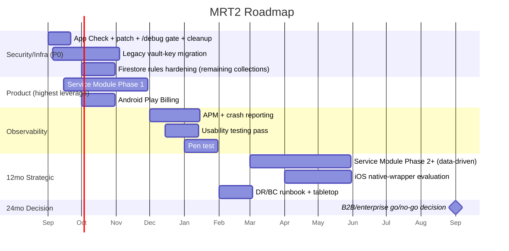

# MRT2 — Roadmap (30 / 90 / 180 / 365 / 730 Days)

*Derived directly from the Gap Analysis and Modernization Opportunities. Sequenced by dependency and leverage, not by category — security/infra items that unlock everything else come first, then the single highest-leverage product move, then breadth.*

---

## 30-Day Roadmap — "Close the open doors"

**Quick wins (all P0/P1, all cheap):**
- [ ] Ship Firebase App Check across all Cloud Functions and Firestore.
- [ ] Patch `react-router-dom`/`react-router` (zero-cost version bump).
- [ ] Gate `/debug` behind `isAdmin` or strip it from production builds.
- [ ] Align devcontainer to Node 24; remove `.eslintrc.json` and `vite.config.bak`.
- [ ] Pull and review existing `web-vitals` → PostHog data (instrumentation already live).
- [ ] Configure GCP budget alerting (already flagged internally as deferred).

**Strategic investment kickoff:**
- [ ] Scope and begin the legacy vault-key migration UX (forcing/encouraging PIN rotation for pre-PROJ-65 accounts).
- [ ] Scope the Service Module Phase 1 (sponsee list + notes) — begin design work now given it needs a new dashboard entry point.

## 90-Day Roadmap — "Ship the highest-leverage product gap"

**High ROI:**
- [ ] **Ship Service Module Phase 1** (per its own existing spec's phasing) — this is the single highest-leverage item in the entire audit.
- [ ] Complete the legacy vault-key migration (forced or strongly-nudged rotation flow).
- [ ] Close the Android in-app-purchase gap (Play Billing integration, or at minimum a clear redirect-to-web upgrade CTA inside the TWA).
- [ ] Extend `firestore.rules` shape/size validation to the remaining 4 sensitive collections.

**Quick wins (if not done in the first 30 days):**
- [ ] Global `prefers-reduced-motion`/`focus-visible` CSS baseline.
- [ ] Structurally enforce encrypt-before-write (typed wrapper or lint rule) in `useFirestoreCrud.ts`.

## 6-Month Roadmap — "Instrument and de-risk at scale"

**Strategic investments:**
- [ ] Stand up real APM/tracing + a crash-reporting SDK (Sentry or equivalent).
- [ ] Third-party penetration test, especially if any enterprise/B2B motion is being considered.
- [ ] A structured, moderated usability-testing pass against each of the 6 personas' documented worst-case scenarios.
- [ ] Publish a consumer-legible "why zero-knowledge" trust page — converting the audit-verified ZK architecture into a marketing/trust asset.
- [ ] Decide (not necessarily build) whether the un-marketed Buddhist/Recovery Dharma and MAT niches warrant dedicated positioning/marketing investment.

**Quick wins carried forward if still open:**
- [ ] AI golden-answer eval suite for the 9 approved Gemini flows.
- [ ] `noUncheckedIndexedAccess` remediation cycle.

## 12-Month Roadmap — "Prove the growth thesis and prepare for the next scale tier"

- [ ] Measure the Service Module's actual effect on Lisa-persona activation/referral (the audit's central growth hypothesis) and iterate on Phase 2+ accordingly.
- [ ] Re-tune `generateAIInsights`'s concurrency ceiling and other hardcoded limits against real traffic data (per the Scalability Review's 10k-100k tier guidance).
- [ ] Evaluate an iOS native-wrapper strategy (Capacitor or equivalent) to close the push-notification reliability gap the PWA-only approach has on iOS.
- [ ] Formal DR/BC runbook, written and tabletop-tested (not just documented in the abstract).
- [ ] Revisit multi-region Firestore configuration decision if international expansion beyond the current AA/NA/SMART/Recovery-Dharma fellowship base is being considered.

## 24-Month Roadmap — "Decide the next horizon"

- [ ] **Strategic decision point: pursue a B2B/enterprise motion (treatment centers, EAPs) or stay consumer-only.** This is a genuine fork, not a default extension of the current roadmap — pursuing it requires SSO, a multi-tenant admin console, formal HIPAA-readiness, and a different sales motion entirely. This audit does not recommend a direction; it flags that the decision should be made deliberately, informed by the growth data gathered from the Service Module launch and 12-month metrics.
- [ ] If pursuing B2B: begin SOC 2 Type I readiness work (the existing engineering discipline — CI gates, documented specs, incident response — is a strong foundation for this).
- [ ] If staying consumer-only: consider i18n investment only if a specific non-English market opportunity is identified — this is explicitly *not* recommended as a default 24-month item absent that signal, given its cost (a full string-externalization pass across the entire app).
- [ ] Reassess the entire Recovery Games layer's engagement data against its build investment — it's a confirmed differentiator with no direct competitor match; whether to double down (more games) or consolidate depends on data this audit did not have access to.

---

## Roadmap at a Glance

