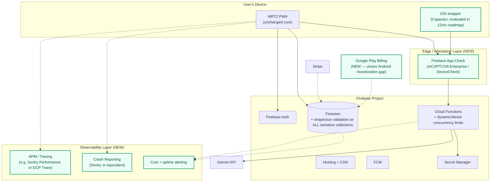
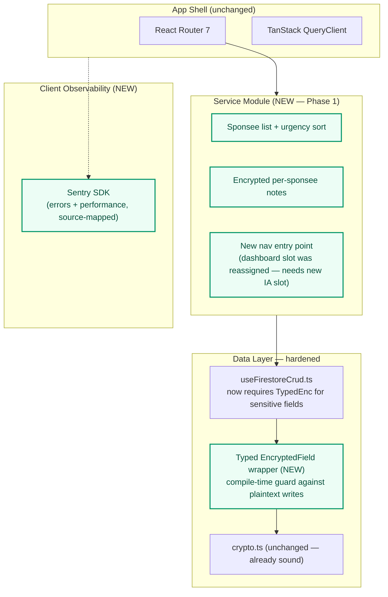
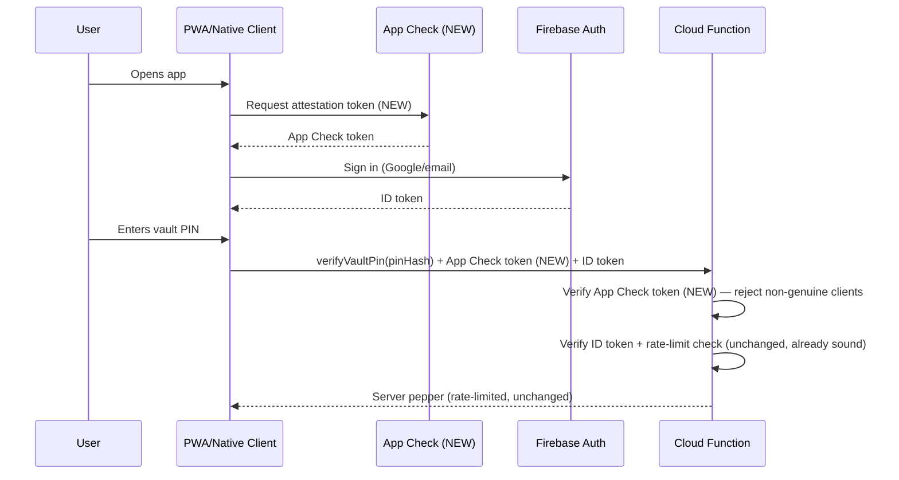
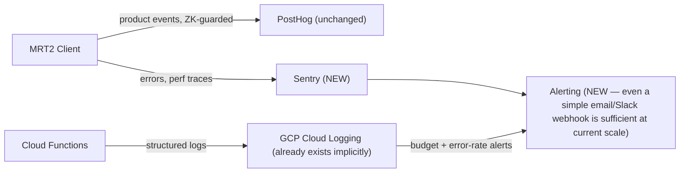

# MRT2 — Future-State Architecture

*This is a target architecture built by extending MRT2's existing, verified design with the specific gaps closed elsewhere in this audit — it is deliberately **not** a rewrite recommendation. Every finding in this report supports evolution, not replacement, of the current Firebase-centric architecture.*

---

## 1. Guiding Principle

**Keep the zero-knowledge core untouched; harden everything around it.** The single most valuable asset uncovered by this audit is a verified, working zero-knowledge architecture — any future-state design that touches or risks that boundary needs a materially stronger justification than convenience. Every recommendation below is chosen specifically because it adds a layer *around* the existing trust boundary rather than punching through it.

## 2. Target System Context Diagram

## 3. Target Container Diagram — What Changes Client-Side

## 4. Target Database/Schema Changes

| Collection | Current state | Target state |
|---|---|---|
| `workbook_answers`, `service`, `rosc_assessments`, `game_progress` | No shape/size validation | Add the same `isValidXShape()`/`isValidXSize()` pattern already proven on `journals`/`game_saves` |
| `sponsees/{sponseeId}` *(NEW)* | Does not exist | Owner-scoped (sponsor `uid`), encrypted notes field, unencrypted "next meeting" timestamp + urgency-sort metadata — matching the pattern already proven across every other encrypted collection |
| `users/{uid}.usesPepperV2` | Optional, migration-pending | A forced or strongly-nudged migration path so this converges to `true` for the full user base over a defined window |

No new database *technology* is needed — Firestore's document model and the existing rules pattern extend cleanly to the Service Module's data needs.

## 5. Target Authentication Flow (unchanged, +App Check)

The only change to this flow is the App Check token being attached and verified — the actual PIN-verification and rate-limiting logic (already independently verified as sound in the Security Assessment) is untouched.

## 6. Target Deployment / CI/CD

The existing 7-gate pipeline (audit → lint → spec-check → unit tests → functions tests → functions audit → Firestore-rules emulator tests → E2E) is already strong and does not need restructuring. Additions:

- **Gate 8 (new): Lighthouse CI budget check** — fail the build if bundle-size or Core Web Vitals budgets regress, closing the "we built good chunking but never measured if it stayed good" gap identified in the Performance Review.
- **A staging/preview-channel deploy step** for `release/*` branches before UAT promotion — the current pipeline deploys directly to `channelId: live`; a preview-channel intermediate step would reduce blast radius for a bad UAT deploy, though this is a "nice to have," not a finding-driven urgent gap.

## 7. Target Monitoring & Analytics

No new analytics *platform* is recommended — PostHog's existing ZK-guarded telemetry design is sound and should be extended, not replaced. The gap is purely in error/performance visibility (Sentry) and alerting (currently absent), not in product analytics.

## 8. Technology Recommendations & Justification

| Decision | Recommendation | Justification |
|---|---|---|
| Backend platform | **Keep Firebase.** | Verified sound to 1M+ users (Scalability Review); rewriting to a different backend would discard a working, audited zero-knowledge implementation for no architectural necessity. |
| Frontend framework | **Keep React 19 + Vite.** | Modern, well-maintained, no forcing function to change. |
| Attestation | **Add Firebase App Check.** | Native fit for the existing Firebase stack; closes a confirmed, internally-acknowledged gap with the least integration effort of any comparable option. |
| Error/perf monitoring | **Add Sentry (or GCP-native equivalent if cost/vendor preference favors it).** | Industry-standard, source-map-aware, integrates with both React and Cloud Functions; closes the Observability gap without requiring a bespoke build. |
| Payments (Android) | **Add Google Play Billing for the TWA build specifically.** | Required by Play Store policy for digital-goods purchases inside a TWA; the current silent-hide approach is a compliance-adjacent workaround, not a long-term solution. |
| Formatting | **Add Prettier alongside the existing ESLint config.** | Standard pairing; low effort, removes a class of bikeshed. |
| i18n | **Do not add yet.** | No evidence of a specific non-English market opportunity; the cost (full string-externalization) is too high to justify speculatively. Revisit if/when a market signal appears. |
| Mobile strategy | **Evaluate (don't yet commit to) a Capacitor-based iOS wrapper.** | The PWA-first strategy is sound and should not be abandoned; the evaluation is specifically to address iOS's weaker push-notification support for a product where push (The Beacon) is a core retention mechanism. |

## 9. What This Future-State Explicitly Does NOT Recommend

- **No migration off Firestore.** Nothing in this audit's evidence suggests Firestore is or will become a bottleneck at any tier examined.
- **No introduction of a global state-management library.** The current Context+TanStack Query approach is working well and adding Redux/Zustand now would be pure churn.
- **No abandonment of the PWA-first strategy in favor of full native.** The evaluation recommended is narrow (iOS push reliability specifically), not a wholesale native rewrite.
- **No relaxation of the zero-knowledge boundary for the sake of any feature** (including the Service Module — sponsee notes should be encrypted exactly like every other sensitive collection, per the existing, proven pattern).
