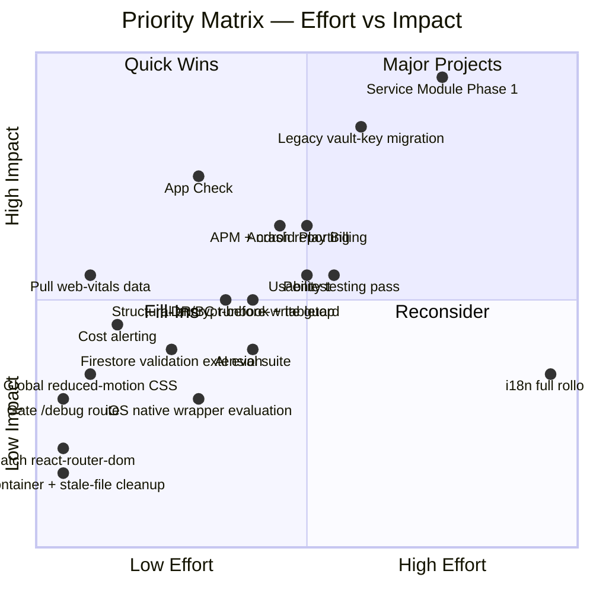

# MRT2 — Risk Matrix, Priority Matrix & Technical Debt Register

---

## Risk Matrix (Likelihood × Impact)

*Likelihood reflects how probable the risk is to materialize as-is over the next 6-12 months; Impact reflects consequence severity if it does. Positioning is this audit's qualitative judgment based on the evidence gathered, not a quantitative model.*

```mermaid
quadrantChart
    title Risk Matrix — Likelihood vs Impact
    x-axis Low Likelihood --> High Likelihood
    y-axis Low Impact --> High Impact
    quadrant-1 Monitor Closely
    quadrant-2 Critical — Act Now
    quadrant-3 Accept / Low Priority
    quadrant-4 Mitigate Opportunistically
    Legacy vault-key gap: [0.55, 0.85]
    No App Check + no cost alerting: [0.5, 0.75]
    No APM/crash reporting: [0.6, 0.55]
    Service Module absence (growth risk): [0.7, 0.7]
    Android IAP revenue leak: [0.85, 0.4]
    react-router-dom CVE: [0.15, 0.2]
    Debug route exposure: [0.2, 0.25]
    No DR/BC runbook: [0.25, 0.55]
    Encrypt-before-write convention gap: [0.2, 0.6]
    Firestore validation gaps (4 collections): [0.3, 0.35]
    No pentest performed: [0.35, 0.5]
    Node version drift: [0.3, 0.1]
    Compliance docs unverified: [0.3, 0.4]
```

**Reading the matrix:**
- **Critical — act now (top-right-ish, high on both axes):** legacy vault-key gap, App Check + cost-alerting combination, Service Module absence.
- **Monitor closely (high impact, more moderate likelihood):** DR/BC runbook absence, no pentest, encrypt-before-write convention gap.
- **Mitigate opportunistically (high likelihood, lower individual impact):** Android IAP gap, APM/crash-reporting absence, Firestore validation gaps.
- **Accept / low priority:** Node version drift, the `react-router-dom` CVE (given confirmed SPA/non-RSC mode), debug-route exposure (self-scoped blast radius).

---

## Priority Matrix (Effort × Impact)



**Reading the matrix:**
- **Quick wins (low effort, high impact) — do these immediately:** App Check, pulling web-vitals data, patching `react-router-dom`, gating `/debug`, devcontainer/stale-file cleanup, cost alerting.
- **Major projects (high effort, high impact) — plan deliberately, don't skip:** Service Module Phase 1, legacy vault-key migration, Android Play Billing, APM/crash reporting, pentest, usability testing.
- **Fill-ins (lower impact, moderate-low effort) — do opportunistically between major work:** Firestore validation extension, global reduced-motion CSS, AI eval suite, iOS wrapper evaluation.
- **Reconsider (high effort, comparatively lower immediate impact) — don't commit without a specific trigger:** full i18n rollout absent a market signal.

---

## Technical Debt Register

| ID | Description | Location | Severity | Status | Recommended Remediation |
|---|---|---|---|---|---|
| TD-01 | Legacy (pre-PROJ-65) accounts use unpeppered PBKDF2-only vault-key derivation | `src/lib/crypto.ts` (`generateKey`), `EncryptionContext.tsx` | High | Open, tracked internally | Forced/nudged PIN-rotation migration flow |
| TD-02 | Encrypt-before-write enforced by convention only | `src/hooks/useFirestoreCrud.ts` | Medium | Open, newly surfaced by this audit | Typed wrapper or custom lint rule |
| TD-03 | Firestore shape/size validation missing on 4 of 6 sensitive collections | `firestore.rules` | Medium | Open, explicitly scoped-down in PROJ-99 | Extend the existing `journals`/`game_saves` pattern |
| TD-04 | 13 files bypass the hooks-only Firestore-access convention | Various (`JournalHistory.tsx`, `AchievementsTab.tsx`, `admin/*`) | Low-Medium | Open | Incremental refactor into `src/hooks/` |
| TD-05 | `noUncheckedIndexedAccess` not enabled | `tsconfig.app.json` | Low-Medium | Open, explicitly deferred (164 errors found when evaluated) | Dedicated remediation cycle |
| TD-06 | No App Check on Cloud Functions | `functions/src/index.ts` | High (grows with scale) | Open, internally acknowledged in `docs/reports/2026-08_full_production_readiness_audit.md` | Integrate Firebase App Check |
| TD-07 | No APM/crash reporting | Whole client + functions | Medium (grows with scale) | Open | Sentry or equivalent |
| TD-08 | No documented/tested DR/BC runbook confirmed | `docs/RUNBOOK.md` (contents unaudited) | Medium | Unverified — needs a direct read to confirm severity | Read/complete/tabletop-test the runbook |
| TD-09 | Devcontainer pinned to Node 20 vs. CI/prod Node 24 | `.devcontainer/devcontainer.json` | Low | Open | Bump to Node 24 |
| TD-10 | Vestigial `.eslintrc.json` alongside real flat config | Repo root | Low | Open | Delete |
| TD-11 | Vestigial `vite.config.bak` | Repo root | Low | Open | Delete |
| TD-12 | Circular chunk warning (`pdf-export -> vendor -> pdf-export`) | `vite.config.ts` manual chunks | Low | Open | Adjust chunk boundaries |
| TD-13 | `react-router-dom`/`react-router` HIGH npm-audit finding | `package.json` | Low (given confirmed non-RSC mode) | Open, fix available | `npm audit fix` / version bump |
| TD-14 | `/debug` route has no role gate, only a UI banner | `src/pages/DebugTools.tsx`, `App.tsx` route table | Low-Medium | Open | Add `isAdmin` gate or strip from prod build |
| TD-15 | No formatter (Prettier) config confirmed | Repo root | Low | Unverified/Open | Add Prettier |
| TD-16 | Two soft-hidden games (`active: false`) with no documented reactivation criteria | `src/pages/GamesHub.tsx`, games registry | Low | Open (ambiguous, not urgent) | Product decision + documentation |
| TD-17 | "SMART Goal" tool card is a permanent-looking stub | `src/pages/ToolsHub.tsx` | Low | Open | Build or remove |
| TD-18 | `PROJ-28`/`PROJ-19` referenced in code comments with no matching spec file in `docs/projects/` | `AppShell.tsx`, Resentment Burner | Very Low | Open (doc-traceability only) | Reconcile numbering / restore archived spec reference |
| TD-19 | Zero i18n infrastructure | Entire `src/` | Low today / High if market expands | Open (not currently urgent) | Defer until a market signal justifies the cost |
| TD-20 | 17 moderate npm-audit findings not individually enumerated in this pass | `package.json` / `functions/package.json` | Low (dev-tooling-dominated pattern observed in the 8 HIGH findings) | Partially unverified | Run a full untruncated `npm audit` as a follow-up |

**Debt register totals:** 20 tracked items — 3 High/Medium-High, 9 Medium, 8 Low. This is a modest, well-bounded debt load for a codebase of this size and feature breadth, consistent with the "actively tracked, not hidden" pattern already evidenced by the project's own internal Debt Ledger maintenance protocol.
