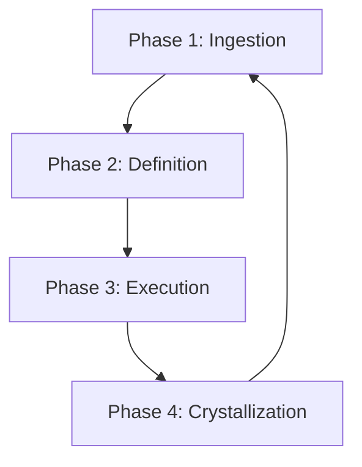

# 📘 MRT Developer & AI Governance Guide

> [!NOTE]
> This guide is the single source of truth for developer workflows, AI coding standards, and maintenance protocols in My Recovery Toolkit (MRT).

---

## 1. 🔁 The Recursive Build Protocol

Maintain high-velocity, error-free feature delivery by enforcing strict context ingestion, architectural planning, and anti-regression coding standards. Do not skip phases.



### Phase 1: Ingestion (Start of Session)
* **Trigger:** Start of a new chat session or after a massive codebase refactor.
* **Goal:** Force the AI to ingest actual file structures and rules rather than rely on training data.
* **Action:** Run `npm run export:llm` to generate codebase chunks under `llm-export/`. Provide the master index `llm-export/00-MASTER-INDEX.md` and relevant chunk files.

### Phase 2: Definition (Strategy)
* **Trigger:** Prior to writing code for a new feature, bug fix, or refactoring task.
* **Goal:** Outline architecture, data schemas, and potential risks before editing code.
* **Prompt Template (Feature Kickoff):**
  ```text
  Subject: Feature Kickoff Request - [Feature Name]
  Context: [Brief description of what you want to achieve]

  Your Instructions:
  1. Architectural Analysis (Context First):
     - Review the Developer Guide and current file structure.
     - Identify which existing components, hooks, or contexts will be impacted.
     - Safety Check: Identify risks (e.g., PWA offline syncing, Auth state, Legacy Data compatibility).

  2. Data & Query Analysis:
     - Will this require a new Firebase Query? If using complex filters (where + orderBy), explicitly state if a Composite Index is needed.
     - Are we changing a data model? (e.g., `mood` vs `moodScore`). How will we handle old data that lacks this field?

  3. Modernization Scan:
     - Check related code for "Tech Debt" (e.g., loose typing, unused imports).
     - Are there newer React or Firebase patterns we should utilize?

  4. Strategy Proposal (The Rule of 3):
     - Option A (Conservative): Quickest implementation, minimal impact.
     - Option B (Refactored/Modern - RECOMMENDED): Best balance of clean code and maintenance.
     - Option C (Robust/Scalable): High-performance/Over-engineered approach.

  5. The Recommendation:
     - Select the best option.
     - Explain why it fits our "Production Readiness" standard.

  6. STOP AND WAIT:
     - DO NOT generate code yet.
     - Present the analysis and wait for my formal approval.
  ```

### Phase 3: Execution (The Build)
* **Trigger:** The plan is agreed upon and the developer authorizes the build.
* **Goal:** Generate clean, type-safe code that passes formatting, building, and testing checks.
* **Prompt Template (Approval & Validation):**
  ```text
  I formally approve the recommended approach. Please proceed with implementing the approved changes.

  Instructions for Code Generation:
  1. Alignment & Strategy:
     - Briefly restate the core objective to confirm alignment.
  2. Targeted Edits:
     - Use precise file modifications rather than full-file rewrites. Do not use placeholders (e.g. "// ... rest of code").
  3. Strict TypeScript & Linting Compliance (Zero-Tolerance):
     - Type-Only Imports: You MUST use `import type { ... }` for interfaces/types.
     - Discriminating Unions: If handling Union types (e.g., `Journal | Workbook`), check the `type` property BEFORE accessing unique fields.
     - Intermediate Casting: If spreading raw DB data into a strict type, cast to `unknown` first (e.g., `as unknown as JournalEntry`).
     - React Refresh: If exporting a Provider and Hook in the same file, append `// eslint-disable-next-line react-refresh/only-export-components`.
  4. Anti-Regression & Fail-Safe Protocol:
     - Fail-Safe Lists: When mapping over external data, wrap the logic in a `try/catch` block or return a fallback object.
     - Legacy Data Support: Always provide fallbacks for missing fields (e.g., `entry.moodScore || 0`).
     - Guard Clauses: Always include `if (!user)` or `if (!db)` guards before Firebase calls.
  ```

### Phase 4: Crystallization (Documentation)
* **Trigger:** The code is written, linted, and tests pass.
* **Goal:** Document architectural decisions and update project board status.
* **Actions:**
  * Update spec files in `docs/specs/` to match any approved deviations.
  * Run the `ticket-close` protocol.
  * Execute:
    ```bash
    python scripts/sync_ticket_docs.py --proj PROJ-XX --summary "Brief summary of changes." --apply
    ```

---

## 2. 🛠️ The Maintenance Protocols

Automate "shadow processes" to prevent code rot, documentation drift, and technical debt accumulation.

### Protocol A: The Schema Sync (Data Dictionary)
* **Frequency:** Weekly, or after modifying Firestore models.
* **Goal:** Maintain [SCHEMA_ARCHITECTURE.md](file:///workspaces/MRT2/docs/SCHEMA_ARCHITECTURE.md) to reflect the true structure of DB fields.
* **Task:**
  1. Audit `src/lib/db.ts` and `src/components/` for new field writes.
  2. Ensure every field is documented in `docs/SCHEMA_ARCHITECTURE.md` with type, description, and encryption status.
  3. Highlight virtual fields vs database fields.

### Protocol B: The Debt Ledger (Technical Debt Audit)
* **Frequency:** Bi-weekly.
* **Goal:** Eliminate codebase noise, loose types, and stale comments.
* **Task:**
  1. Scan for comments containing `TODO`, `FIXME`, or `HACK`.
  2. Scan for `any` type usage, ESLint suppression directives, and `@ts-ignore` flags.
  3. Scan for magic numbers and raw un-localized strings.
  4. Log findings to [ACTIVE_CYCLE.md](file:///workspaces/MRT2/docs/ACTIVE_CYCLE.md) under "Chores & Tech Debt".

### Protocol C: The Release Scribe (Changelog)
* **Frequency:** Prior to merging to production (`main`).
* **Goal:** Document user-facing changes under [changelog.md](file:///workspaces/MRT2/docs-site/support/changelog.md).
* **Format:**
  ```markdown
  ## [vX.Y.Z] - YYYY-MM-DD
  ### ✨ [Features / Improvements / Fixes]
  - **Component Name [PROJ-ID]:** User-friendly description of change translating technical work into user benefits.
  ```

---

## 3. 👥 Personas & UX Design Rules

MRT adapts to users as they progress or relapse in recovery. Code and UI choices should always be evaluated against the user's journey stage.

```
Day 1-30      → David (Survival, crisis-first design)
Day 30-90     → Ned (Momentum, gamification, habit building)
Day 90+       → Pink Cloud Crash transition point — highest design risk
Month 3-18    → Maya (Systematic learning, CBT, workbook completion)
Year 1+       → Walt (Deep reflection, long-term patterns, data sovereignty)
Year 7+       → Lisa (Service, sponsorship, giving back — Step 12)
```

### The Persona Profiles
1. **David (The Survivor - Day 1-30):** Relapsed, high anxiety, cognitively overloaded.
   * *Constraint:* Max 3 taps per flow. Large touch targets. Immediate access to SOS / sponsor hotline without unlocking the encryption vault. No complex graphs or paragraphs of text.
2. **Ned (The Momentum Builder - Day 30-90):** Early recovery, highly motivated.
   * *Constraint:* Needs streaks, rings, and badges. Optimistic UI feedback.
3. **Maya (The Systematiser - Month 3-18):** Analytical, structured.
   * *Constraint:* Focuses on structured CBT worksheets, workbook exercises, and step completions.
4. **Walt (The Zen Master - Year 1+):** Long-term sobriety, values deep reflection.
   * *Constraint:* Wants deep AI Insights, emotional trends, data export (sovereignty), and journal history timeline navigation.
5. **Lisa (The Service Star - Year 7+):** Sponsor.
   * *Constraint:* Service network tools to track sponsees anonymously without breaking their ZK boundary.

> [!WARNING]
> **The Day 90 Pink Cloud Crash:** When streaks break, Ned is vulnerable to shame relapses. Do not make streak numbers prominent if they reset to 0. Pivot the dashboard from quantitative metrics (days) to qualitative value (workbook answers, insights) to cushion the emotional blow.
