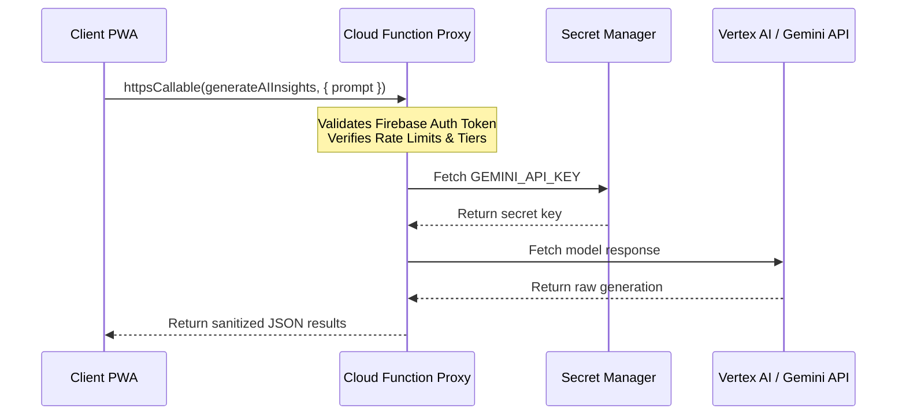

# MRT Codebase Audit: Scalability, Gaps & AI Solutions Report

*   **Audit Date**: July 2026
*   **Target Scope**: System Architecture, Zero-Knowledge Boundary, Offline Resilience, Telemetry, and AI Integrations
*   **Objective**: Prepare the codebase for secure scaling, ensuring high reliability under high user loads.

---

## 1. Current State Assessment
MRT is structured as a React 19 + Vite 7 + Firebase 12 single-page application.
*   **Strengths**: Strict TanStack Query layer routing, modular Tailwind components, zero `any` types, 100% Vitest coverage on core hooks, and client-side encryption of user journals.
*   **Scalability Readiness**: Currently, the PWA builds clean, caches PWA precaching assets, and operates locally in UAT/mock modes. However, critical vulnerabilities exist in the API key and key-derivation architectures that block safe public production release.

---

## 2. Security Gaps & Remediations

### Gap A: Exposed Client-Side Gemini API Key
*   **Vulnerability**: `src/lib/gemini.ts` initiates GoogleGenerativeAI with `import.meta.env.VITE_GEMINI_API_KEY`. Vite bundles `VITE_`-prefixed env variables into client-side JS. Any user can extract this key, leading to quota draining and billing abuse.
*   **Remediation (Cloud Functions Proxy)**:
    1.  Deprecate client-side imports of `@google/generative-ai`.
    2.  Write a Firebase Cloud Function (e.g., `generateAIInsights`) inside the `/functions` package.
    3.  Configure the Cloud Function to pull the API key from **Google Cloud Secret Manager** (`defineSecret('GEMINI_API_KEY')`).
    4.  Expose the function as an HTTPS Callable (`onCall`).
    5.  The client invokes the proxy using `httpsCallable(functions, 'generateAIInsights')`. Firebase Auth automatically passes the ID token, allowing server-side validation of active subscription tiers and request counts before invoking Vertex AI.



---

### Gap B: Low-Entropy 4-Digit PIN Key Derivation
*   **Vulnerability**: `src/lib/crypto.ts` derives the AES-GCM Vault Key directly from the 4-digit PIN. If Firestore is breached, an attacker gets the verifier hash `Hash(PIN + Salt)` and the encrypted documents. A dictionary search on 10,000 combinations (0000-9999) can crack the PIN in milliseconds.
*   **Remediation (Hybrid Key Derivation)**:
    1.  **Generate a Master Key**: On Vault creation, the client generates a random, cryptographically secure 256-bit `Master Key` in the browser.
    2.  **Encrypt the Master Key**: The user enters a 4-digit PIN. The client derives a temporary key using PBKDF2 (100k iterations) on the PIN + Salt.
    3.  **Local Storage**: The client encrypts the 256-bit `Master Key` using the PIN-derived key and stores the encrypted master key in `IndexedDB`.
    4.  **Firestore Write**: The client writes journals and workbook answers to Firestore encrypted *only* with the high-entropy 256-bit `Master Key`.
    5.  **Brute-force Shield**: Firestore never stores the PIN verifier hash or salt. The PIN is verified locally by attempting to decrypt the local `IndexedDB` master key. If the database is compromised, the attacker has no mathematical way to brute force the master key, as it possesses 256 bits of entropy.

```mermaid
graph TD
    subgraph Browser (Client-Side)
        A[User PIN] -->|PBKDF2 100k| B(PIN-Derived Key)
        C[Random 256-bit Master Key] -->|Encrypted via PIN Key| D(Encrypted Master Key)
        D -->|Saved| E[(IndexedDB)]
        C -->|Encrypts| F[Journal Text]
    end
    subgraph Cloud Storage (Server-Side)
        F -->|Ciphertext Only| G[(Firestore)]
    end
```

---

## 3. Offline Resilience Gaps

### Gap: Missing Firestore Persistent Local Cache
*   **Vulnerability**: Currently, `src/lib/firebase.ts` calls `getFirestore(app)` without cache parameters. If the user opens the PWA offline, Firestore fetches fail, causing the app shell to freeze or report loading errors.
*   **Remediation**:
    Explicitly enable persistent caching during Firestore initialization. Modify `src/lib/firebase.ts`:
    ```typescript
    import { initializeFirestore, persistentLocalCache, persistentMultipleTabManager } from "firebase/firestore";

    export const db = app
      ? initializeFirestore(app, {
          localCache: persistentLocalCache({
            tabManager: persistentMultipleTabManager()
          })
        })
      : undefined;
    ```
    This automatically saves reads to IndexedDB locally and queues offline writes for transparent background synchronization when connectivity resumes.

---

## 4. Telemetry & Analytics Gaps

### Gap: Silent Decryption and Synced Failures
*   **Vulnerability**: Decryption failures (e.g. key corruption) catch silently inside `console.warn` or show generic fallback text to the user. There is no telemetry tracking to log when users encounter decryption failures, which blocks diagnosing client-side key sync errors.
*   **Remediation**:
    Anonymously report HMAC mismatch/decryption corruption metrics to PostHog, skipping sensitive keys/contexts.

---

## 5. Client-Side Rate-Limiting Gaps

### Gap: Client-Enforced AI Rate Limits
*   **Vulnerability**: Rate limits are verified client-side in `useRateLimits.ts` by checking timestamps on the user's profile document. A user can edit the local Javascript bundle or bypass the client validation rules to spam Gemini API calls.
*   **Remediation**:
    Move usage stamp validations inside the Cloud Functions proxy.
    *   The Cloud Function reads the user's `usage_limits` from Firestore server-side.
    *   It checks limits, processes the AI prompt, and increments the timestamp atomically in a transaction before returning the response.

---

## 6. Implementation Roadmap

```mermaid
gantt
    title Gaps Remediation Roadmap (Next Sprint)
    dateFormat  YYYY-MM-DD
    section Security
    Cloud Functions AI Proxy      :active, a1, 2026-07-14, 5d
    Hybrid Key Derivation         :after a1, a2, 5d
    section Resilience
    Firestore IndexedDB Cache     :b1, 2026-07-14, 2d
    section Telemetry
    PostHog Error Analytics       :c1, 2026-07-21, 3d
```
