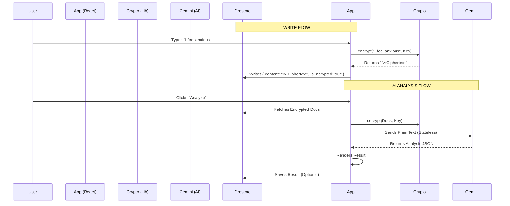

# 📖 Feature Specification: The Journal (The Vault)

**Status:** Live (v2.0)
**Security Level:** Zero-Knowledge (Client-Side AES-GCM)
**Primary Persona:** David (The Crisis User), Walt (The Zen Master), Ned (Pink Cloud)

---

## 1. Overview
The Journal is the central "Input" mechanism of My Recovery Toolkit. It allows users to document their daily inventory, process emotions, and receive AI-driven recovery coaching. Crucially, it is a **secure, encrypted vault**; plain text data is never stored on the server.

## 2. The Three Modes (Tabs)
The Journal functionality is split into three distinct views via `JournalTabs.tsx`:

### A. Write (The Editor)
* **Input Methods:**
    * **Text:** Rich-text inputs (via `JournalEditor.tsx`).
    * **Voice-to-Vault:** Integrated `AudioRecorder.tsx` captures audio, sends it to Gemini 2.5 Flash for transcription + sentiment analysis, and auto-fills the editor.
* **Metadata:**
    * **Mood Slider:** 1-10 scale (Struggling ↔ Thriving).
    * **Weather:** Auto-fetched local weather (Temp/Condition) via Open-Meteo.
    * **Tags:** Dynamic tagging system with auto-complete based on previous usage.
* **Templates:**
    * Standard: Morning Check-in, Nightly Review, Urge Log, Meeting Reflection.
    * Custom: Users can define their own prompts via `TemplateEditor.tsx`.

### B. History (The Timeline & Search)
* **View:** Virtualized list (`Virtuoso`) grouped by date headers (Today, Yesterday, etc.).
* **The Memory Engine (Search):** * **Mechanism:** A client-side search bar filters entries *after* they are decrypted in memory.
    * **Routing:** Uses URLSearchParams (`?search=xyz`) to allow deep-linking to specific query states.
    * **Scope:** Matches against Entry Content and Tags.
* **Visuals:** Each card displays Mood Badge, Weather Icon, and Encryption Status.
* **Actions:** Edit, Delete, and Share (decrypts to clipboard/native share sheet).

### C. Insights (The Dashboard)
* **Source:** `JournalInsights.tsx`
* **Data Scope:** Rolling 90-day window from local IndexedDB/Firestore cache.
* **Visualizations:**
    1.  **Weekly Rhythm:** A Bar Chart comparing "Average Mood" of the *Last 30 Days* vs the *Previous 30 Days*.
    2.  **Trend Indicator:** A calculated "Trend Arrow" (↗️/↘️) showing if the user's 30-day average mood is improving or declining compared to the previous period.
    3.  **Interactive Word Cloud:** Frequency analysis of entry content. 
        * *Interaction:* Clicking a word routes the user to the History tab and auto-populates the search filter with that word.
    4.  **Top Stats:** Total Entries, Active Streak, and Average Mood Score.

---

## 3. Advanced AI Features

### 🧠 The Analysis Wizard
* **Component:** `JournalAnalysisWizard.tsx`
* **Concept:** A "on-demand" recovery coach that reads decrypted history to find patterns.
* **Scopes:**
    * **Weekly:** Last 7 days vs Previous 7 days.
    * **Monthly:** Last 30 days vs Previous 30 days.
    * **Deep Dive:** All-time / 90-day pattern recognition.
* **Usage Limits:** Controlled via `UserProfile.usage_limits` to manage API costs (e.g., 1 Deep Dive per month).
* **Output:** Generates a `ComparativeAnalysisResult` which is saved to the `insights` collection.
* **Actionable:** Users can click suggested actions to add them directly to their **Tasks/Quests**.

### 🎙️ Voice-to-Vault
* **Component:** `AudioRecorder.tsx`
* **Flow:**
    1.  User records audio (MediaRecorder API).
    2.  Audio Blob converted to Base64.
    3.  Sent to Gemini 2.5 Flash (Multimodal).
    4.  **Result:** Returns Transcription + Mood Score + Smart Tags.
    5.  Populates the Editor state.

---

## 4. Technical Architecture

### Data Flow & Encryption

### Database Schema (Journal Specific)
**Collection:** `journals`
| Field | Type | Description | Encryption |
| :--- | :--- | :--- | :--- |
| `uid` | String | Owner ID | No |
| `content` | String | The body text | **YES (AES-GCM)** |
| `moodScore` | Number | 1-10 Integer | No (For Stats) |
| `tags` | Array | e.g. `["Anxiety", "Work"]` | No (For Filtering) |
| `weather` | Map | `{ temp: 22, condition: "Rain" }` | No |
| `isEncrypted` | Bool | Flag for legacy data handling | No |
| `createdAt` | Timestamp | Creation Time | No |

---

## 5. Edge Cases & Constraints

1.  **Lost PIN:**
    * Since the encryption key is derived from the PIN, a lost PIN results in **permanent data loss** for journal content. Metadata (Mood/Tags) remains visible but content is unreadable.
    * *Mitigation:* `VaultGate.tsx` warns users clearly.

2.  **AI Privacy:**
    * Journal text is decrypted in browser memory *only* for the duration of the API call.
    * Gemini API calls are stateless (data is not stored by Google for model training).

3.  **API Failures:**
    * If `getCurrentWeather` fails (e.g., permissions denied), the entry saves with `weather: null`.
    * If Gemini fails (403/500), the user can still save the text manually.
